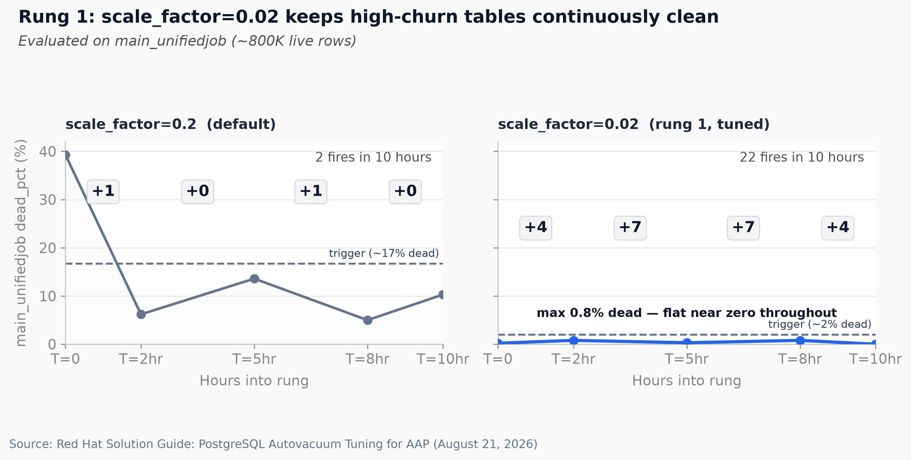
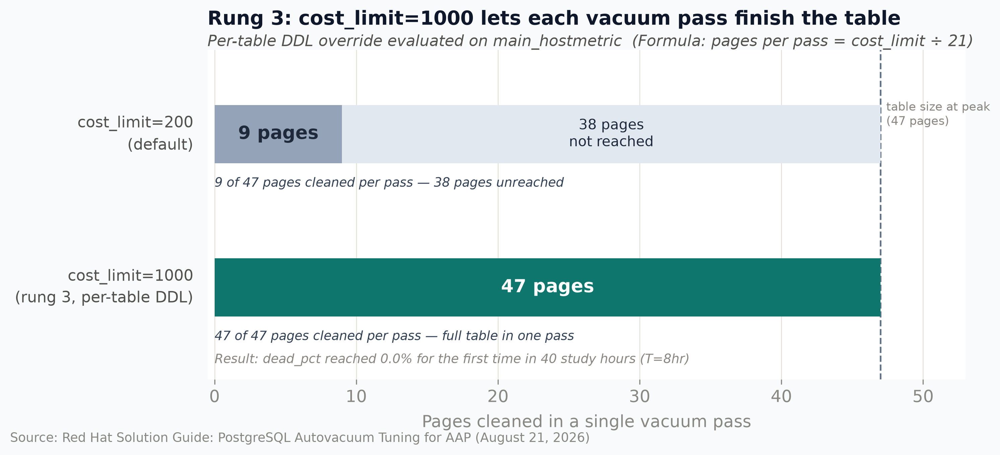

# PostgreSQL Autovacuum Tuning for Ansible Automation Platform — Solution Guide

## Overview

<div class="guide-outcome">
Three <code>postgresql.conf</code> changes, applied in order, keep high-churn AAP tables continuously clean.
</div>

AAP at enterprise scale writes incessantly to large tables in its PostgreSQL database, keeping track of: job execution records, authorization tokens, and host health checks. PostgreSQL's default autovacuum settings were designed for smaller, less write-intensive databases and do not keep pace with this workload.

Every UPDATE and DELETE in PostgreSQL leaves behind a "dead tuple" - the old row - rather than modifying the row in place. On large, frequently-written tables these accumulate quickly: at production AAP scale, a single high-churn table can generate ~27,000 dead tuples per hour. With default autovacuum settings, these dead tuples can wait around for more than 6 hours before autovacuum clears them. While they wait, queries must still scan over dead tuples even though they are invisible to them, degrading performance and, at scale, producing user-visible slowdowns.


<p class="guide-image-caption">Decision diagram: use this to pick your starting rung, then follow the <a href="#tuning-path">tuning path</a> below.</p>

> **Tip:** Parameter glossary
>
> See [Key Terms](#key-terms) at the end for definitions of metrics, settings, and failure modes used throughout this guide.

## Prerequisites
- Superuser access to the AAP PostgreSQL instance
- Ability to edit `postgresql.conf` and run `SELECT pg_reload_conf()`
- Operational impact: **Low** as all changes are reversible; `scale_factor` and `naptime`
  take effect on reload with no restart required

> **OpenShift / CNPG deployments:**
>
> Set parameters in the Cluster custom resource under
> `.spec.postgresql.parameters`, then apply with `oc apply`. A `pg_reload_conf()` call is
> not needed — CNPG handles the reload. Per-table `ALTER TABLE` commands (Rung 3) are
> applied the same way via `psql`.

---

## Baseline at scale

In a large AAP deployment, the database receives a continuous stream of writes: every executed job creates and updates records in `main_unifiedjob`; every API call touches the OAuth2 token table; every automation run updates host metrics. Tables grow to hundreds of thousands of rows and are updated thousands of times per hour. In this environment, PostgreSQL's default setting `scale_factor=0.2` falls short.

The chart in Rung 1 (left panel) shows `main_unifiedjob` under default settings:

- Dead rows stood at 39.3% at the start—reflecting accumulated bloat from high write volume prior to tuning.
- Despite the bloat, autovacuum fired **only 2 times** in 10 hours. While vacuuming cleared the table each time,
  it could not keep up with the accumulation rate.
- Dead_pct climbed back to 10.3% by the end of the rung and was continuing to rise.

The root cause: `scale_factor=0.2` means that, at this scale, autovacuum waits for 160,000 dead
tuples on an 800K-row table before acting. At ~27,000 dead tuples/hour, that
threshold is crossed every ~6 hours. *The table never stays clean.*

**Ready to tune?** See the [tuning path](#tuning-path) below, then [Rung 1](#rung-1-lower-the-trigger).

---

## Tuning path

| | Apply | When |
|---|---|---|
| **Start here** | [Rung 1](#rung-1-lower-the-trigger) — `scale_factor`, `max_workers` | Every large AAP deployment. |
| **Add next** | [Rung 2](#rung-2-increase-check-frequency) — `naptime` | When the `hot_ratio` query confirms that HOT is disabled on high-churn tables. |
| **Add if needed** | [Rung 3](#rung-3-ensure-each-pass-completes) — per-table `cost_limit` | Only after the Rung 3 diagnostic tests confirm incomplete vacuuming. |

---

## Rung 1: Lower the Trigger



**Apply this if:** Your large, frequently-updated tables show autovacuum firing only a few
times per day, or `dead_pct` stays above 10% for hours. If you're running AAP with
thousands of jobs per day, assume you need this.

> **Tip:** Enterprise scale factor impact
>
> In an enterprise AAP environment managing ~70,000 hosts and running ~40,000 jobs per day,
> decreasing `scale_factor` from its default setting of 0.2 to 0.02 reduced total database execution time by 96.7%.

**The change** using `postgresql.conf`:

<p class="code-lead">Apply in postgresql.conf:</p>

```
autovacuum_vacuum_scale_factor = 0.02
autovacuum_max_workers = 6
```

<p class="code-lead">Run this:</p>

```sql
SELECT pg_reload_conf();
```

**How to tune `scale_factor`:** Work backwards from the maximum `dead_pct` you want to
allow before autovacuum fires. At large table sizes, `scale_factor ≈ target_dead_pct ÷ 100`:

| Target max dead_pct | scale_factor |
|---|---|
| ~10% | 0.10 |
| ~5% | 0.05 |
| ~2% | 0.02 ← used in this study |
| ~1% | 0.01 |

For query-performance-sensitive tables (large sequential scans, join targets), 2% is a
reasonable ceiling. After choosing a `scale_factor` value, estimate the expected autovacuum
fire rate to flag any table where each pass must complete efficiently:

<p class="code-lead code-lead--reference">Reference formula:</p>

```
estimated fires/hr ≈ dead_tuple_rate_per_hr ÷ (scale_factor × n_live_rows)
```

A high autovacuum fire rate (roughly more than 100 fires/hr on a single table) is not itself a problem as
autovacuum is designed to run frequently. But it signals that each vacuum pass may have a hard time
finishing and, therefore, keeping pace. If this scenario is a concern, run the Rung 3 diagnostic to
confirm passes are completing. Raising `scale_factor` back up would lower the fire rate but allow more
dead tuples to accumulate between passes, which would be the incorrect fix.

**How to compute `max_workers`:** In a large AAP deployment, the four highest-churn tables
are `main_unifiedjob`, `main_jobhostmetric`, `main_hostmetric`, and `gateway.dab_oauth2`.
Count the tables in this group that apply to your deployment and add 2 for background
maintenance headroom. For a full AAP stack, `max_workers=6` covers all four plus headroom.
Setting it higher than needed is not harmful; autovacuum only spawns workers when tables
require it.

**Result:** Autovacuum ran 22 times vs. 2 during the prior rung; `dead_pct` on `main_unifiedjob` never exceeded 0.8% for the remainder of the study.

---

## Rung 2: Increase Check Frequency


**Apply this if:** You have a table where a frequently-updated column is also indexed. If
this is the case, HOT (Heap Only Tuple) optimization is disabled on that table. HOT allows
PostgreSQL to handle an UPDATE entirely within the same page without creating a dead tuple —
but only when the updated column has no index. When the column is indexed, PostgreSQL must
update the index too, so every UPDATE produces a dead tuple that autovacuum must clean.
The following query returns `hot_ratio` — the percentage of updates handled by HOT — for
each table, ordered by update volume:

<p class="code-lead">Run this diagnostic:</p>

```sql
SELECT relname,
       n_tup_upd,
       n_tup_hot_upd,
       round(100.0 * n_tup_hot_upd / nullif(n_tup_upd, 0), 1) AS hot_ratio
FROM pg_stat_user_tables
WHERE n_tup_upd > 0
ORDER BY n_tup_upd DESC;
```

Any table showing `hot_ratio` well below 100% has HOT disabled and is generating a dead
tuple on every UPDATE.

> **Tip:** Why naptime matters for OAuth2 tables
>
> OAuth2 and session tables receive an update on every API request. At 82 dead tuples/second, a 60-second check interval allows nearly 5,000 dead tuples accumulate between inspections. naptime=10s reduces the backlog to about 820 dead tuples and produces a 6× increase in vacuuming.


**The change** with `postgresql.conf`:

<p class="code-lead">Apply in postgresql.conf:</p>

```
autovacuum_naptime = 10s
autovacuum_vacuum_threshold = 20
```

<p class="code-lead">Run this:</p>

```sql
SELECT pg_reload_conf();
```

Lowering `vacuum_threshold` from 50 to 20 dead tuples ensures small, high-churn tables are not ignored. A table with only a few thousand rows may never accumulate 50 dead tuples between checks, but at high update rates, 20 is crossed almost immediately.

**Result:** On `gateway.dab_oauth2`, vacuuming fires averaged 530 per 10-hour rung before
naptime changed (461 fires in rung 0; 600 in rung 1) and 3,571 after (3,574 in rung 2;
3,568 in rung 3); a 6× increase. At naptime=10s, the table is re-inspected every 10
seconds instead of every 60s, allowing autovacuum to respond before the dead-tuple backlog
grows to problematic levels.

If HOT is already disabled in your environment, naptime=10s is the sole driver of this
improvement. In this study, an index on `last_used` was added at the same time naptime
changed, which disabled HOT updates on `gateway.dab_oauth2` simultaneously and amplified
the effect. If that index already existed in your environment, the full 6× gain is from
naptime alone.

---

## Rung 3: Ensure Each Pass Completes



**Apply this if:** Autovacuum runs frequently on a specific table but dead tuples persist anyway. The sign to look for: `autovacuum_count` is increasing fast AND `n_dead_tup` stays elevated at the same time. To find affected tables:

<p class="code-lead">Run this diagnostic:</p>

```sql
SELECT relname,
       n_dead_tup,
       n_live_tup,
       round(100.0 * n_dead_tup / nullif(n_dead_tup + n_live_tup, 0), 1) AS dead_pct,
       autovacuum_count
FROM pg_stat_user_tables
WHERE n_dead_tup > 100
  AND autovacuum_count > 500
ORDER BY autovacuum_count DESC;
```

Confirm the bottleneck by catching a live pass in progress:

<p class="code-lead">Run this diagnostic:</p>

```sql
SELECT p.relid::regclass                                          AS table,
       p.heap_blks_total                                          AS total_pages,
       p.heap_blks_vacuumed                                       AS pages_cleaned,
       round(100.0 * p.heap_blks_vacuumed
             / nullif(p.heap_blks_total, 0), 1)                   AS pct_done
FROM pg_stat_progress_vacuum p
WHERE p.phase != 'initializing';
```

If `pct_done` is consistently below 100% when passes end, the I/O throttle is cutting each
pass short before the table is fully cleaned.

> **Tip:** High fire rate with persistent dead tuples
>
> Autovacuum running 300+ times/hour while dead tuples persist is not a trigger problem. Rather, each pass is being cut short before the table is fully vacuumed. This diagnostic confirms whether the I/O throttle is actually the bottleneck before you apply the change.

**Estimate a starting `cost_limit`** Run this diagnostic step when `n_dead_tup` is elevated on the target table. Watching `pg_stat_user_tables` for a few minutes will catch a high point:

<p class="code-lead code-lead--reference">Adapt table name:</p>

```sql
SELECT relname,
       ceil(pg_relation_size(schemaname||'.'||relname) / 8192.0)      AS pages,
       ceil(pg_relation_size(schemaname||'.'||relname) / 8192.0) * 21 AS cost_limit_cached,
       ceil(pg_relation_size(schemaname||'.'||relname) / 8192.0) * 30 AS cost_limit_uncached
FROM pg_stat_user_tables
WHERE relname = 'your_table_name';
```

Small tables (a few thousand rows or fewer) are almost always in memory. Use `cost_limit_cached` as your starting value, rounding up to a clean number. It estimates the budget needed to scan all heap pages once without interruption. Apply it, then use the three-outcome check below to decide whether to adjust upward or remove the override.

The formula covers heap pages only; index cleanup and the visibility map mean real behavior may differ, which is why the empirical check follows.

**Apply per-table** This does not touch global settings:

<p class="code-lead code-lead--reference">Adapt schema and table name:</p>

```sql
ALTER TABLE schema.tablename
  SET (autovacuum_vacuum_cost_limit = <computed_value>);
```

For example, `main_hostmetric` at peak: 47 pages × 21 = 987, rounded to 1,000.

**Three possible outcomes — all informative:**

| Outcome | Signal | Interpretation |
|---------|---------------------------------------|-----------------|
| **Positive** | Same fire rate; dead_pct → 0 | cost_limit was the bottleneck; keep the setting |
| **Flat** | Fire rate and dead_pct unchanged | cost_limit is not the issue; look elsewhere |
| **Warning** | CPU spike without improvement | cost_limit too aggressive for available I/O headroom; dial back |

This is a per-table override. It does not change the global `cost_limit` so the effect is isolated to the single table you're targeting.

In this study with `cost_limit=1000` on `main_hostmetric`, the table reached 0.0% dead during Rung 3 at T=8hr, the first complete cleanup of this table in 40 study hours; a **positive** outcome. The other high-churn tables (`main_unifiedjob`, `gateway.dab_oauth2`) did not require a `cost_limit` override as Rungs 1 and 2 were already keeping them clean.


---

## Validation

Allow at least 2 hours of steady-state operation after each rung before evaluating.

**Rung 1** -- confirm `scale_factor` is working:

<p class="code-lead">Run this validation query:</p>

```sql
SELECT relname,
       autovacuum_count,
       n_dead_tup,
       round(100.0 * n_dead_tup / nullif(n_dead_tup + n_live_tup, 0), 1) AS dead_pct,
       last_autovacuum
FROM pg_stat_user_tables
WHERE relname IN ('main_unifiedjob', 'main_jobhostmetric')
ORDER BY relname;
```

Expected: `dead_pct` consistently below 2%; `autovacuum_count` incrementing multiple times
per hour. Take two snapshots 30 minutes apart and compare `autovacuum_count`.

A healthy snapshot with Rung 1 applied (from the study environment):

<p class="code-lead code-lead--reference">Expected output:</p>

```
      relname       | autovacuum_count | n_dead_tup | dead_pct |      last_autovacuum
--------------------+------------------+------------+----------+----------------------------
 main_jobhostmetric |              214 |        480 |      0.1 | 2026-08-15 14:22:14+00
 main_unifiedjob    |              381 |          0 |      0.0 | 2026-08-15 14:23:17+00
(2 rows)
```

`dead_pct` near zero; `last_autovacuum` within the past few minutes on both tables.

**Rung 2** — confirm `naptime` is working:

Run the same query against your HOT-disabled tables. Expected: `autovacuum_count`
incrementing far faster than Rung 1 tables. Two snapshots 10 minutes apart should show
a meaningful delta.

If your environment has Prometheus instrumentation, `db_cpu_throttle` should remain flat after applying all three rungs. In the study it stayed in the 0.02–0.05 range throughout. UI job latency (p75) should show no increase; the study measured 754–762ms across all rungs with no degradation.

**Rung 3** — confirm `cost_limit` is working:

Watch `pg_stat_progress_vacuum` during a live pass on the target table. `pct_done` should
reach 100% before the pass ends. If it does not, increase `cost_limit` and re-check.

---

## Troubleshooting

Same rung mapping as the [tuning path](#tuning-path) table. Use this section when you see the symptom in production.

| Symptom | Likely Cause | Fix |
|---|---|---|
| `dead_pct` climbs for hours; autovacuum fires only a few times per day | Trigger-limited: `scale_factor` too high; threshold rarely crossed | Lower `scale_factor` → [Rung 1](#rung-1-lower-the-trigger) |
| `autovacuum_count` rising fast but `n_dead_tup` stays elevated after each fire | Throttle-limited: each pass cut short by `cost_limit` before the table is fully cleaned | Set per-table `cost_limit` → [Rung 3](#rung-3-ensure-each-pass-completes) |
| `autovacuum_count` rising very fast; `dead_pct` spikes sharply between fires | HOT disabled on a high-churn table: every UPDATE creates a dead tuple | Lower `naptime` → [Rung 2](#rung-2-increase-check-frequency) |

---

## Key Terms

Quick reference for metrics, settings, and diagnostic views. Settings show the short name used in this guide, followed by the `postgresql.conf` parameter in parentheses.

<nav class="key-terms-nav" aria-label="Key Terms categories">
  <a href="#key-terms-core">Core concepts</a>
  <a href="#key-terms-metrics">Metrics and views</a>
  <a href="#key-terms-settings">Settings</a>
  <a href="#key-terms-failure-modes">Failure modes</a>
</nav>

<div class="key-terms-group">

<h3 id="key-terms-core">Core concepts</h3>

<dl class="key-terms-glossary">
<dt>autovacuum</dt>
<dd>PostgreSQL background process that removes dead tuples when configurable thresholds are met; it does not run continuously.
<span class="key-terms-detail">Tuned via multiple <code>autovacuum_*</code> settings in <code>postgresql.conf</code>. See <a href="#key-terms-settings">Settings</a> below.</span></dd>

<dt>dead tuple</dt>
<dd>Old row copy left behind after an UPDATE or DELETE; vacuum removes it and reclaims space.
<span class="key-terms-detail">PostgreSQL writes a new row rather than modifying in place. Queries must scan past dead tuples even though they are invisible to them.</span></dd>

<dt>HOT (Heap Only Tuple)</dt>
<dd>In-page update optimization: when the changed column is not indexed, PostgreSQL can update the row without creating a dead tuple visible to autovacuum.
<span class="key-terms-detail">Disabled when the updated column is indexed -- every UPDATE then produces a dead tuple. Diagnose with the <code>hot_ratio</code> query in <a href="#rung-2-increase-check-frequency">Rung 2</a>.</span></dd>
</dl>

</div>

<div class="key-terms-group">

<h3 id="key-terms-metrics">Metrics and views</h3>

<dl class="key-terms-glossary">
<dt>autovacuum_count</dt>
<dd>Running total of completed vacuum passes on a table (column in <code>pg_stat_user_tables</code>); subtract two snapshots to get passes in an interval.
<span class="key-terms-detail">Unlike <code>n_dead_tup</code>, this counter never resets -- a low reading always means vacuum has not run, not that you checked right after a cleanup. Used in <a href="#validation">Validation</a> for all three rungs.</span></dd>

<dt>dead_pct</dt>
<dd>Dead rows as a percentage of total rows (live + dead). At 30%+, queries scan significant dead data on every read.
<span class="key-terms-detail">From <code>pg_stat_user_tables</code>:</span>
<pre class="key-terms-formula"><code>dead_pct = 100.0 * n_dead_tup / (n_live_tup + n_dead_tup)</code></pre>
</dd>

<dt>n_dead_tup</dt>
<dd>Raw dead-tuple count on a table (column in <code>pg_stat_user_tables</code>).
<span class="key-terms-detail">Useful for spotting throttle-limited tables, but can read zero right after a pass fires on high-churn tables. Prefer <code>autovacuum_count</code> delta as the primary signal.</span></dd>

<dt>n_tup_hot_upd / n_tup_upd</dt>
<dd>Update counters in <code>pg_stat_user_tables</code>; <code>hot_ratio = n_tup_hot_upd / n_tup_upd</code>.
<span class="key-terms-detail">A ratio well below 100% on a high-write table means HOT is disabled -- typically because the updated column is indexed. See <a href="#rung-2-increase-check-frequency">Rung 2</a>.</span></dd>

<dt>pg_stat_user_tables</dt>
<dd>Per-table vacuum statistics view: <code>autovacuum_count</code>, <code>n_dead_tup</code>, <code>n_live_tup</code>, <code>n_tup_upd</code>, <code>n_tup_hot_upd</code>, <code>last_autovacuum</code>.
<span class="key-terms-detail">Primary diagnostic source for all three rungs and the <a href="#validation">Validation</a> queries.</span></dd>

<dt>pg_stat_progress_vacuum</dt>
<dd>Real-time view of active vacuum passes; key columns are <code>heap_blks_total</code> and <code>heap_blks_vacuumed</code>.
<span class="key-terms-detail">Confirm <code>pct_done</code> reaches 100% before a pass ends. Used in <a href="#rung-3-ensure-each-pass-completes">Rung 3</a> and <a href="#validation">Validation</a>.</span></dd>
</dl>

</div>

<div class="key-terms-group">

<h3 id="key-terms-settings">Settings (<code>postgresql.conf</code>)</h3>

<dl class="key-terms-glossary">
<dt>scale_factor (<code>autovacuum_vacuum_scale_factor</code>)</dt>
<dd>Fraction of live rows that must be dead before autovacuum fires; default 0.2 (20%).
<span class="key-terms-detail">On an 800K-row table, 0.2 waits for 160,000 dead tuples; 0.02 fires at 16,000. At large tables, target <code>dead_pct</code> ≈ <code>scale_factor</code> × 100. Apply in <a href="#rung-1-lower-the-trigger">Rung 1</a>.</span></dd>

<dt>max_workers (<code>autovacuum_max_workers</code>)</dt>
<dd>Maximum tables vacuumed simultaneously; default 3.
<span class="key-terms-detail">Increase when multiple high-churn tables compete for vacuum attention. Set alongside <code>scale_factor</code> in <a href="#rung-1-lower-the-trigger">Rung 1</a>.</span></dd>

<dt>naptime (<code>autovacuum_naptime</code>)</dt>
<dd>Interval between autovacuum wake-ups to check each table; default 60 seconds.
<span class="key-terms-detail">At 60s on a table receiving thousands of updates per minute, nearly 5,000 dead tuples can accumulate between checks. Lower to 10s in <a href="#rung-2-increase-check-frequency">Rung 2</a>.</span></dd>

<dt>vacuum_threshold (<code>autovacuum_vacuum_threshold</code>)</dt>
<dd>Minimum absolute dead-tuple count before autovacuum considers a table, regardless of <code>scale_factor</code>; default 50.
<span class="key-terms-detail">Lowering to 20 ensures small, high-churn tables are not ignored. Set in <a href="#rung-2-increase-check-frequency">Rung 2</a>.</span></dd>

<dt>cost_limit (<code>autovacuum_vacuum_cost_limit</code>)</dt>
<dd>I/O budget for a single autovacuum pass before pausing; default 200 (~9 pages per pass).
<span class="key-terms-detail">At 1,000, autovacuum cleans ~47 pages per pass. Set per-table with <code>ALTER TABLE ... SET (autovacuum_vacuum_cost_limit = N)</code> in <a href="#rung-3-ensure-each-pass-completes">Rung 3</a> without changing the global default.</span></dd>
</dl>

</div>

<div class="key-terms-group">

<h3 id="key-terms-failure-modes">Failure modes</h3>

<p class="key-terms-table-note"><strong>trigger-limited</strong> and <strong>throttle-limited</strong> describe why autovacuum falls behind despite different symptoms. See the <a href="#tuning-path">tuning path</a> for which rung to apply and <a href="#troubleshooting">Troubleshooting</a> for symptom-to-fix mapping in production.</p>

</div>

---

## Related Guides

- [AAP HA/DR on OpenShift with CloudNativePG](https://ansible-tmm.github.io/solution-guides/README-AAP-HA-DR-OpenShift) — the deployment topology this autovacuum tuning applies to
- [High-Availability AAP with EDB PostgreSQL DR](https://ansible-tmm.github.io/solution-guides/README-EDB) — the EDB variant of the same HA/DR problem

---

## Next Steps

<div class="key-terms-closing">

- [Review the decision diagram in Overview](#overview)
- [Follow the tuning path](#tuning-path) for rung order
- [Jump to Key Terms](#key-terms) for a parameter lookup
- [Back to Ansible Guides](/)

</div>
