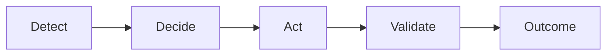


<div class="guide-header">

<h1>Self-healing infrastructure: From EDA to Orchestrated Automation</h1>

<span class="guide-type-badge guide-type-badge--use-case"><i class="fas fa-layer-group" aria-hidden="true"></i> AIOps Use Case</span>

</div>

> **Pattern guide, not a partner integration.**
>
> Observability tools in examples are interchangeable. Self-healing requires **controlled autonomy**: detect, decide, act, validate, with approvals where risk demands it.

## Overview

Known issues with proven fixes still wait in alert queues while someone diagnoses and runs remediation manually. **Self-healing infrastructure** closes the loop: observability detects failure, AI correlates the signal, automation **selects from an approved library** (see [Curated Automation Remediation](README-AIOps-Use-Case-04-Curated-Automation-Remediation.md)), executes governed workflows, and validation confirms recovery. Closed-loop Run does **not** require novel playbook generation at alert time.

**Challenge:** Delay, inconsistency, and on-call toil for repeatable failures.

**Solved with AI + automation:** Observability platforms detect system-level failures. AI interprets signals and maps them to **pre-approved** remediation. AAP executes with permissions and audit. Automation orchestrator coordinates validation and escalation.

**Business outcomes:** Faster recovery, consistent operations, scalable adaptability, controlled autonomy.

> **Buyer question:**
>
> What do we do when something breaks, end to end?

## Background

This is **Run** maturity in the AIOps use-case map. It builds on Crawl (enrichment, cost visibility) and Walk (curated remediation, capacity orchestration). System-level drift and policy enforcement prevents failures from accumulating; [Self-healing infrastructure](README-AIOps-Use-Case-06-Self-Healing-Infrastructure.md) closes the loop when breaks occur. Entry points are primarily **event-initiated** from observability or ITSM.



## Solution

- **EDA** ingests alerts and events
- **AAP** executes remediation and validation playbooks
- **AI** for diagnosis and playbook selection (prefer curated library; see [Curated Automation Remediation](README-AIOps-Use-Case-04-Curated-Automation-Remediation.md))
- **AO** for approval, loops, and post-remediation validation workflows

### Who Benefits

| Persona | Challenge | What They Gain |
|---------|-----------|----------------|
| **SRE / on-call** | Repeated manual recovery steps | Automated detect-act-validate |
| **Automation architect** | Fragile one-off runbooks | Closed-loop, governed design |
| **IT leader** | MTTR and customer impact | Measurable recovery time |

## Prerequisites

- Ansible Automation Platform 2.5 or later
- Event-Driven Ansible connected to observability or ITSM
- Automation orchestrator for full closed-loop workflows at Run maturity
- Approved remediation library (strongly recommended before autonomous act steps)

## EDA to AO adoption path

> **Coming soon:**
>
> Full walkthrough aligned to detect-decide-act-validate will be added. Until then, combine [Incident and Ticket Enrichment](README-AIOps-Use-Case-01-Incident-Ticket-Enrichment.md) Stages 1 and 4 with partner Solution Guides below.

### Stage 1: EDA + AAP only

Automated remediation for known alert types with validation playbooks.

### Stage 2: AI enrichment

AI-assisted diagnosis before human or automated act steps.

### Stage 3+: Automation orchestrator

Closed-loop workflows with approval, loops, and validation nodes.

## Validation

| Check | Success indicator |
|-------|-------------------|
| Detect to act on known failure class | EDA or MCP client receives alert with enough context to select a library template |
| Curated execute | Governed job completes; observability or validation job shows recovery |
| Optional workshop appendix | Four-stage checklist in [appendix validation](#appendix-validation-workshop-pipeline) passes in lab only |

<h2 id="optional-appendix-workshop-multi-llm-pipeline-policy-governed-only"></h2>

## Optional appendix: workshop multi-LLM pipeline (policy-governed only)

> **Not for production default.**
>
> Use this pipeline only after lab testing, Git promotion, policy-as-code, and explicit approval gates. Run the [Hands-On AIOps Workshop](https://rhpds.github.io/ai-driven-automation-showroom/modules/index.html) first. Production **Run** self-healing should follow [curated remediation on the foundational guide](README-AIOps.md#4-curated-automation-remediation-walk) and [Curated Automation Remediation (use case 4)](README-AIOps-Use-Case-04-Curated-Automation-Remediation.md).

<h3 id="workshop-run-pipeline"></h3>

### Workshop pipeline: multi-LLM playbook generation (Run demo)

> **Workshop and Run demo, not the default customer path.**
>
> The four-part pipeline below matches the [Hands-On AIOps Workshop](https://rhpds.github.io/ai-driven-automation-showroom/modules/index.html). It shows **Automation code assistant** playbook generation and Git promotion for teams exploring **Run** depth. Most deployments should stay on the [curated MCP path](README-AIOps.md#4-curated-automation-remediation-walk) until policy explicitly allows incident-time codegen.

An AIOps **workshop** pipeline has four (4) parts:

1. **Event-Driven Ansible (EDA) Response**

   Respond to an event, such as a systemd application outage.  This falls under the **Observability** part of the AIOps workflow.  EDA allows us to plug-in **observability** to an **automation** workflow.

2. **Log Enrichment and Prompt Generation Workflow**

   AAP coordinates with Red Hat AI, notifies your chat application or ITSM (IT service management tool).  This falls under the **Inference** part of the AIOps workflow.  Again, Ansible Automation Platform ties this into an **automation** workflow.

3. **Remediation Workflow**

   Generates a playbook via Ansible Lightspeed, syncs it to Git, builds another Job Template.  This also falls under the **Inference** part of the AIOps workflow.  For this solution we are using one AI LLM endpoint (Red Hat AI) to figure out what the issue is and diagnose it, and one AI LLM endpoint to create an Ansible Playbook to remediate the issue.  This is considered a **multi-LLM workflow**, as we are using 2 or more LLM endpoints within our workflow.

4. **Execute Remediation**

   The final Job Template that fixes the issue on your IT infrastructure.  This is executing the Ansible Playbook that was generated in the previous workflow.  This falls under the **automation** part of AIOps and wraps up our self healing infrastructure use-case.

### Operational Impact per Stage (workshop pipeline)

| Stage | Operational Impact | Why |
|-------|-------------------|-----|
| **1. EDA Response** | **None** | Read-only -- EDA listens to events and triggers a workflow. No changes to systems. |
| **2. Enrichment Workflow** | **Low** | Collects logs, calls an AI API, posts to chat/ITSM. The only write is a notification message -- no infrastructure changes. |
| **3. Remediation Workflow** | **Low** | Generates a playbook, commits to Git, creates a Job Template. Prepares the fix but does not touch production infrastructure. |
| **4. Execute Remediation** | **High** | Modifies production infrastructure (restarting services, changing config files, etc.). Should go through a change window or approval gate. |

Stages 1-3 are safe to experiment with in any environment. Stage 4 is where production risk lives -- which is why the guide recommends a manual approval gate at the **Walk** maturity level and policy-governed auto-approval at the **Run** level.

> **Could this be one workflow?**
>
> Yes -- but it’s broken up for review points and easier adoption.

<h3 id="example-workflow-diagram"></h3>

### Example Workflow Diagram (workshop)

This diagram is from the hands-on workshop **Introduction to AI-Driven Ansible Automation**. It illustrates the **codegen** Run pipeline, not the default [curated MCP reference architecture](README-AIOps.md#4-curated-automation-remediation-walk).

[](https://github.com/rhpds/showroom-lb2961-ai-driven-ansible-automation/blob/main/solution_images/overview_diagram.png?raw=true)


> **This is a high level diagram.**
>
> It shows an opinionated approach for AIOps that is easily customizable for a variety of IT infrastructure use-cases.

<h2 id="1-event-driven-ansible-eda-response"></h2>

## 1. Event-Driven Ansible (EDA) Response

The first part of the AIOps workflow is the **Event-Driven Ansible (EDA) Response**.  Here is a breakdown of the four main components:

<a target="_blank" href="https://github.com/rhpds/showroom-lb2961-ai-driven-ansible-automation/blob/main/solution_images/eda_response.png"></a>

  1. IT infrastructure event
  2. Observability tool picks up event
  3. EDA sees event in message queue
  4. Execute Enrichment workflow

<h3 id="example-walkthrough-for-eda-response"></h3>

### Example Walkthrough for EDA Response

In our hands-on workshop we simulate an **httpd** application outage.  This is how the workflow works:

  1. **IT infrastructure event**: The student will break httpd using a Job Template
  2. **Observability tool picks up event**: Filebeat monitors Apache logs, Kafka acts as the event transport
  3. **EDA sees event in message queue**: EDA listens to Kafka, launches automation workflows
  4. **Execute Enrichment workflow** Ansible Automation Platform kicks off part 2, **Log Enrichment and Prompt Generation Workflow**

> **Why Kafka?**
>
> <a target="_blank" href="https://kafka.apache.org/">Apache Kafka</a> is a distributed streaming platform used for building real-time data pipelines and streaming applications, enabling applications to publish, consume, and process high volumes of data streams. It is all open source and self hosted and works great for workshops. This could be replaced by any event bus of your choosing. Event-Driven Ansible has numerous plugins including integrations with AWS SQS, AWS CloudTrail, Azure Service Bus, and Prometheus.


> **Why Filebeat?**
>
> <a target="_blank" href="https://www.elastic.co/beats/filebeat">Filebeat</a> is a lightweight shipper for logs. It is also free and open source and works great for lab environments. Event-Driven Ansible has numerous plugins including integrations with BigPanda, Dynatrace, IBM Instana, Zabbix, and CyberArk.

> **Do you need both a message bus and an observability tool?**
>
> It depends on the particular integration. Generally combining a message bus and an observability tool will scale the most, but it really depends on your particular use-case, amount of events, etc. Many observability platforms can work directly with Event-Driven Ansible just fine.

Now that you understand our workflow example, lets dive into production-grade examples:

<h3 id="1-it-infrastructure-event"></h3>

### 1. **IT infrastructure event**:

What kind of events are relevant in an AIOps workflow?  EDA's value proposition is that it is extremely versatile and pluggable.  This means that Ansible Automation Platform can effectively handle any type of event.

However here is a great list of ideas:

<h4 id="img-srchttpscdnjsdelivrnetghtwittertwemoji1402assets72x721f525png-width20-stylevertical-aligntext-bottom-application-level-events"></h4>

####  Application-Level Events

| Event | Source | Example Response |
|-------|--------|------------------|
| **application service crash or stopped** | `systemd`, `monit`, or Prometheus alert | Restart, notify on Slack, check last logs via journald |
| **High 5xx error rate in NGINX/Apache** | Web server logs, Prometheus metrics | Trigger Ansible to roll back a recent deployment or redirect traffic |
| **Application log shows exception spike** | Log aggregator (ELK, Loki, Datadog) | Run Ansible remediation that restarts service and clears cache |
| **Web app fails readiness check** | Kubernetes liveness/readiness probe | Reboot pod, scale another replica, or notify developer team |
| **API latency exceeds threshold** | APM tool (e.g., Dynatrace, Instana) | Provision more backend instances or restart slow services |

<h4 id="img-srchttpscdnjsdelivrnetghtwittertwemoji1402assets72x722699png-width20-stylevertical-aligntext-bottom-infrastructure--platform-events"></h4>

####  Infrastructure & Platform Events

| Event | Source | Example Response |
|-------|--------|------------------|
| **Disk space usage > 90%** | Prometheus Node Exporter, Zabbix | Clean temp files, archive logs, or extend volume |
| **High CPU load on EC2 or VM** | CloudWatch, Telegraf, etc. | Scale out VM set or move workloads |
| **OOM Kill in container** | Kubernetes Events | Restart pod, notify engineering, increase memory limits |
| **Node goes NotReady in Kubernetes** | K8s API | Cordon node, reassign pods, and open a ticket |
| **Filesystem becomes read-only** | `dmesg`, audit logs, OS-level alerts | Unmount and remount or migrate app to another host |

<h4 id="img-srchttpscdnjsdelivrnetghtwittertwemoji1402assets72x721f310png-width20-stylevertical-aligntext-bottom-network--security-events"></h4>

####  Network & Security Events

| Event | Source | Example Response |
|-------|--------|------------------|
| **Interface down / Link failure** | SNMP traps, syslog | Notify NOC, run Ansible playbook to reroute traffic |
| **Unauthorized SSH attempt detected** | Fail2Ban, syslog, SIEM | Block IP, rotate SSH keys, notify SOC |
| **SSL certificate expiring soon** | Certbot, monitoring tool | Auto-renew with Let's Encrypt, push new cert with Ansible |
| **DNS resolution failures** | `systemd-resolved`, DNS logs | Switch DNS provider or fix `/etc/resolv.conf` |

<h4 id="img-srchttpscdnjsdelivrnetghtwittertwemoji1402assets72x721f4a1png-width20-stylevertical-aligntext-bottomobservability-driven-triggers"></h4>

#### Observability-Driven Triggers

| Event | Source | Example Response |
|-------|--------|------------------|
| **SLO breach warning (latency or error rate)** | SRE observability tool | Pre-emptively scale or rollback new features |
| **New critical error introduced in logs post-deploy** | ELK, Honeycomb, etc. | Rollback deployment via Ansible |
| **User reports spike via feedback or ticket** | ITSM tools | Use AI to correlate symptoms, gather diagnostics, and kick off a fix |

<h3 id="2-observability-tool-picks-up-event"></h3>
### 2. **Observability tool picks up event**:

Now that you have a great understanding of types of events, what are great examples of observability tools that can plug-in to an AIOps workflow:

<h4 id="filebeat"></h4>

#### Filebeat


Filebeat is a lightweight, open-source log shipper from Elastic that forwards logs from end-systems to a message aggregator. It is not an observability platform on its own -- it requires a message bus like Kafka to transport events to EDA. We use it in the AIOps workshop because it is free, low-overhead, and easy to deploy in lab environments.

<h4 id="ibm-instana"></h4>

#### IBM Instana


<a target="_blank" href="https://console.redhat.com/ansible/automation-hub/repo/published/ibm/instana/">IBM Instana on Automation hub</a>

IBM Instana provides real-time observability across hybrid and multicloud environments with automatic change detection, end-to-end tracing, and context-rich alerts. Its built-in anomaly detection and contextual correlation make it a natural event source for EDA rulebooks -- Instana can trigger automation workflows directly or through a message bus like Kafka.

<h4 id="splunk"></h4>

#### Splunk


<a target="_blank" href="https://console.redhat.com/ansible/automation-hub/namespaces/splunk/">Splunk on Automation hub</a>

Splunk ingests logs, metrics, traces, and events from virtually any source, providing a centralized view of system health across complex IT environments. Its machine learning and anomaly detection capabilities can proactively surface issues, making it an ideal trigger source for EDA-driven remediation workflows.


<h3 id="3-eda-sees-event-in-message-queue"></h3>

### 3. **EDA sees event in message queue**

Message queues are optional depending on the observability tool.  For example IBM Instana can work directly with Event-Driven Ansible to trigger automation jobs, or it can work with a message queue like Apache Kafka.  Here are some examples of other message queues that Ansible Automation Platform works with:

<h4 id="aws-sqs"></h4>

#### AWS SQS


<a target="_blank" href="https://console.redhat.com/ansible/automation-hub/repo/published/amazon/aws/">AWS on Automation hub</a>

Amazon SQS (Simple Queue Service) is a managed message queuing service that decouples event producers from consumers. In an AIOps workflow, observability tools or AWS CloudWatch can publish events to an SQS queue, and EDA subscribes to that queue to trigger automation.

<h4 id="azure-service-bus"></h4>

#### Azure Service Bus


<a target="_blank" href="https://console.redhat.com/ansible/automation-hub/repo/published/ansible/eda/content/eda%2Fplugins%2Fevent_source/azure_service_bus/">Azure Service Bus on Automation hub</a>

Azure Service Bus is a fully managed enterprise messaging service with message queuing and publish-subscribe capabilities. EDA can subscribe to Service Bus topics or queues to detect events from Azure resources and third-party systems, making it a natural fit for cloud-centric AIOps workflows.

<h4 id="kafka"></h4>

#### Kafka


<a target="_blank" href="https://console.redhat.com/ansible/automation-hub/repo/published/ansible/eda/content/eda%2Fplugins%2Fevent_source/kafka/">Kafka on Automation hub</a>

Apache Kafka is a high-throughput, fault-tolerant event streaming platform that collects telemetry data, logs, alerts, and state changes from diverse sources. EDA listens to Kafka topics for specific patterns and triggers remediation workflows. Kafka's ability to decouple producers and consumers makes it ideal for scaling AIOps pipelines across large environments.

Example rulebook for Kafka:

```yaml
---
- name: Web app issue
  hosts: all
  sources:
   - ansible.eda.kafka:
       host: service1
       port: 9092
       topic: httpd-error-logs

  rules:
    - name: apache shutdown detected
      condition: event.body.message is search("shutting down")
      action:
        run_workflow_template:
          organization: "Default"
          name: "{{ workflow_template_name | default('AI Insights and Lightspeed prompt generation') }}"

    - name: show event messages
      condition: event.body.message is defined
      action:
        debug:
          msg: "{{ event.body.message }}"

```


<h2 id="2-log-enrichment-and-prompt-generation-workflow"></h2>

## 2. Log Enrichment and Prompt Generation Workflow

The second part of the AIOps workflow is the **Log Enrichment and Prompt Generation Workflow** (or for shorthand the Enrichment Workflow).  Here is a breakdown of the four main components:


1. Capture Additional Information
2. Red Hat AI: Analyze Incident
3. Notify Chat / ITSM
4. Build Ansible Lightspeed Job Template

<h3 id="1-capture-additional-information"></h3>

### 1. Capture Additional Information

In our AIops workshop we have an Ansible Playbook that captures additional information from the host.  If server01 reports an outage with an application (e.g. httpd), we can have Ansible collect additional information to

1. Confirm the systemd process is down
2. Collect relevant logs
3. Collect system information (operating system, memory, etc).

This process is similar to agentic workflow, where we capture information, just as we need it.

> **What is an agentic workflow?**
>
> An **agentic workflow** with AI refers to a system where an AI agent is empowered to make decisions, take actions, and pursue goals across multiple steps--often autonomously. Unlike a single API call or a static prompt, agentic workflows involve **planning, reasoning, tool use**, and possibly interacting with other agents or services. These agents maintain **state**, adjust behavior based on feedback, and operate in loops (like ReAct or AutoGPT). The goal is to replicate more human-like problem solving, where the AI isn't just responding, but actively **working through a task**. This is especially useful in AIOps, automation, and multi-step orchestration.

In this case we have a static workflow versus a fully agentic workflow, but unlike just a static LLM query, we are giving inputs from multiple sources, the event, the observability tool, system logs, and an Ansible Playbook running on the host to retrieve any additional info. In the future you will see increasingly more and more ability for the operations team to allow AI tools the ability to act more autonomously.

<h3 id="2-red-hat-ai-analyze-incident"></h3>

### 2. Red Hat AI: Analyze Incident

To interface with Red Hat AI we can use the `redhat.ai` content collection, which wraps the OpenAI-compatible API into native Ansible modules.  Many AI tools, including Red Hat AI, are using the OpenAI API standard.

> **Why is the OpenAI API the standard?**
>
> The OpenAI API (`/v1/completions`, `/v1/chat/completions`) became a standard for interacting with LLMs because:
> - It was the first widely adopted commercial LLM API
> - It has a clean, JSON-based format that is easy to integrate
> - Tons of apps, SDKs, frameworks (like LangChain, AutoGen, Semantic Kernel) built around it

In an AIOps context, **inference** refers to the process where an AI model receives a question or input--such as a system error, log snippet, or performance metric--via an API, and returns a prediction or insight. This could include identifying root causes, classifying incidents, or suggesting remediation steps. The model has already been trained, so inference is the **real-time application** of that knowledge to live operational data. It's a key part of integrating AI into IT workflows, enabling automated, intelligent responses without human intervention.

Here is an Ansible task for inference to Red Hat AI using the <a target="_blank" href="https://console.redhat.com/ansible/automation-hub/repo/published/redhat/ai">redhat.ai</a> collection:

```yaml
    - name: Analyze incident with Red Hat AI
      redhat.ai.completion:
        base_url: "http://{{ rhelai_server }}:{{ rhelai_port }}"
        token: "{{ rhelai_token }}"
        prompt: "{{ gpt_prompt | default('What is the capital of the USA?') }}"
        model_path: "/root/.cache/instructlab/models/granite-8b-lab-v1"
      delegate_to: localhost
      register: gpt_response
```

- `base_url:` The URL of the Red Hat AI server (the module appends `/v1/completions` automatically).
- `token:` Authentication token for the AI server.
- `prompt:` The text input or question you want the AI to respond to.
- `model_path:` The path to the specific AI model used to generate the response.

The response is available as `gpt_response.choice_0_text` (the first answer) and `gpt_response.raw_response` (the full JSON payload).

For advanced use cases that need full control over parameters like `temperature`, `max_tokens`, `top_p`, and `n`, use the `raw_input` parameter instead:

```yaml
    - name: Analyze incident with Red Hat AI (advanced)
      redhat.ai.completion:
        base_url: "http://{{ rhelai_server }}:{{ rhelai_port }}"
        token: "{{ rhelai_token }}"
        raw_input:
          prompt: "{{ gpt_prompt }}"
          model: "/root/.cache/instructlab/models/granite-8b-lab-v1"
          max_tokens: 50
          temperature: 0
          top_p: 1
          n: 1
      delegate_to: localhost
      register: gpt_response
```

- `temperature:` Controls randomness; lower values make outputs more deterministic, while higher values increase creativity.
- `max_tokens:` The maximum number of tokens (words or sub-words) the AI can generate in its response.
- `top_p:` Limits the AI to sampling from the top probability mass (e.g., top 90%) for more focused outputs.
- `n:` Specifies how many different completions you want the AI to generate for the given prompt.

Alternatively, you can call the OpenAI-compatible API directly with `ansible.builtin.uri`. This approach works with any model server -- not just Red Hat AI:

```yaml
    - name: Send POST request using uri module
      ansible.builtin.uri:
        url: "http://{{ rhelai_server }}:{{ rhelai_port }}/v1/completions"
        method: POST
        headers:
          accept: "application/json"
          Content-Type: "application/json"
          Authorization: "Bearer {{ rhelai_token }}"
        body:
          prompt: "{{ gpt_prompt | default('What is the capital of the USA?') }}"
          max_tokens: "{{ max_tokens | default('50') }}"
          model: "/root/.cache/instructlab/models/granite-8b-lab-v1"
          temperature: "{{ input_temperature | default(0) }}"
          top_p: "{{ input_top_p | default(1) }}"
          n: "{{ input_n | default(1) }}"
        body_format: json
        return_content: true
        status_code: 200
        timeout: 60
      register: gpt_response
```

Both approaches produce the same result -- the `redhat.ai.completion` module handles the HTTP details (headers, URL path, body format) for you, while `ansible.builtin.uri` gives you full control over the raw request.

> **Why set n: 1?**
>
> You’d want `n: 1` when you’re only interested in getting a single best response from the AI:
> - Reduces overhead: Less processing time and memory usage, especially important when running local models like Red Hat AI.
> - Simplifies parsing: You don’t have to iterate over multiple completions or choose the best one.
> - Keeps things deterministic (especially with `temperature: 0`): When you’re aiming for predictable, repeatable automation, one clear response is ideal.
> - `n: 1` is perfect for most automation tasks where you just need one solid, confident answer without extra noise.
<h4 id="tools-that-support-the-openai-compatible-api"></h4>

#### Tools That Support the OpenAI-Compatible API

| Tool                      | Description                                                                                  |
|---------------------------|----------------------------------------------------------------------------------------------|
| **vLLM**                  | Efficient LLM serving engine with OpenAI-compatible endpoints for both completion and chat APIs |
| **llama.cpp**             | Lightweight C++ LLM inference with a `--server` mode that mimics OpenAI API                  |
| **Ollama**                | CLI + local model manager that serves LLaMA and Mistral models via OpenAI-compatible endpoints |
| **LM Studio**             | GUI for local LLMs that exposes an OpenAI-compatible endpoint                                 |
| **Text Generation WebUI**| Hugely flexible GUI for multiple models (GGUF, HF, etc), includes OpenAI API adapter          |
| **LocalAI**              | Drop-in OpenAI replacement server with multi-backend support (llama.cpp, GPT4All, etc)       |
| **DeepInfra**            | Model hosting provider offering OpenAI-compatible APIs                                       |
| **Replicate**            | Platform for hosting ML models with optional OpenAI-style API access                          |
| **Anyscale**             | Provides OpenAI-compatible APIs for hosted open models with high performance                 |

<h3 id="3-notify-chat--itsm"></h3>

### 3. Notify Chat / ITSM


This is where we synchronize the output from Red Hat AI to another outside system.  Here some great options:

<h4 id="mattermost"></h4>

#### Mattermost


<a target="_blank" href="https://docs.ansible.com/ansible/latest/collections/community/general/mattermost_module.html">Mattermost Documentation</a>

**Mattermost** is an open-source, self-hostable chat platform with robust API and webhook integrations. We use it in the AIOps workshop as a free alternative to Slack or Microsoft Teams -- Ansible posts AI-generated diagnoses and remediation updates to a Mattermost channel in real time.

<h4 id="servicenow"></h4>

#### ServiceNow


<a target="_blank" href="https://console.redhat.com/ansible/automation-hub/repo/published/servicenow/itsm/">ServiceNow on Automation hub</a>

ServiceNow is an enterprise-grade **IT Service Management (ITSM)** platform and the system of record for incidents, changes, and problem management. In AIOps workflows, AI-driven insights enrich ServiceNow tickets automatically, and Ansible closes the loop by triggering remediation directly from ticket data.

<h4 id="slack"></h4>

#### Slack


Slack is an enterprise messaging platform with a rich API and app ecosystem that integrates seamlessly with Ansible, ServiceNow, and monitoring tools. In AIOps workflows, Slack channels serve as a real-time hub where AI-driven alerts, diagnostics, and remediation updates are delivered directly to operations teams.

<h3 id="4-build-ansible-lightspeed-job-template"></h3>

### 4. Build Ansible Lightspeed Job Template

The final piece of this workflow is creating (or updating) a Ansible Automation Platform job template with the insights we just gained from Red Hat AI.

We have a problem, such as an application outage, and we now have a solution: for example: "there is a mis-configuration on this line" and now we can use this information we gleaned and now prompt Ansible Lightspeed in the next workflow, the **Remediation workflow**.  We are basically using one AI endpoint (Red Hat AI) to help create a prompt to a second AI endpoint (Ansible Lightspeed) to create an Ansible Playbook to help remediate the issue.


A way to do this (an opinionated way, but not the only way) is to use an <a target="_blank" href="https://docs.redhat.com/en/documentation/red_hat_ansible_automation_platform/latest/html-single/using_automation_execution/index#controller-surveys-in-job-templates">Ansible Survey</a>.

In the above screenshot, the left is the prompt we will use in the next workflow, while the right is the insights we gleaned from Red Hat AI based on all the information it had.  This is a natural breakpoint where the human can course correct the prompt.  We will still have time to review the solution before we move it into production, but it may make sense for your IT operations team to review this prompt before we move onto Lightspeed.

> **Could we make this one workflow?**
>
> YES! Absolutely. This is just showing how it is easy to adopt AIOps incrementally and add natural breakpoints to review what is happening as you adopt AI into your IT workflows.

Here is an excerpt from the Ansible Playbook used in our AIOps workshop:

```yaml
    - name: Create Job Template
      ansible.controller.job_template:
        name: " Lightspeed Remediation Playbook Generator"
        job_type: "run"
        inventory: "{{ input_inventory | default('Demo Inventory') }}"
        project: "{{ input_project | default('AI-EDA') }}"
        playbook: "{{ input_playbook | default('playbooks/lightspeed_generate.yml') }}"
        credentials:
          - "{{ input_credential | default('AAP') }}"
          - "{{ vault_credential | default('ansible-vault') }}"
        validate_certs: true
        execution_environment: "Default execution environment"

    - name: Load remediation workflow template
      ansible.controller.workflow_job_template:
        name: Remediation Workflow
        organization: Default
        state: present
        survey_enabled: true
        survey_spec: "{{ lookup('template', playbook_dir + '/templates/survey.j2') }}"
```

We are able to dynamically update the survey inside the workflow by using the survey_spec.  The survey spec looks like the following:

```json
{
  "name": "Prompt Lightspeed",
  "description": "Survey for working with Ansible Lightspeed",
  "spec": [
    {
      "type": "textarea",
      "question_name": "Enter a prompt to create a remediation playbook?",
      "question_description": "This prompt will be used with Ansible Lightspeed to automatically generate an Ansible Playbook",
      "variable": "lightspeed_prompt",
      "required": true,
      "default": "For all hosts, use become true,  Remove line that contains InvalidDirectiveHere from /etc/httpd/conf/httpd.conf and restart httpd"
    },
    {
      "type": "textarea",
      "question_name": "This box shows the prompt generated from our Workflow job template",
      "question_description": "This area shows you that AI was able to understand the error and create a prompt for Ansible Lightspeed.",
      "variable": "ai_lightspeed_prompt",
      "required": false,
      "default": "{{ gpt_generated_prompt }}"
    }
  ]
}
```

Now everytime the first workflow **Log Enrichment and Prompt Generation Workflow** runs, the second workflow **Remediation Workflow** automatically has its survey updates to be relevant to that workflow. This is doing **Config as Code** using the ansible.controller content collection.

Please consider using the <a target="_blank" href="https://console.redhat.com/ansible/automation-hub/repo/validated/infra/aap_configuration/">AAP Configuration Collection on Automation hub.</a> This content collection simplifies interactions for Ansible Automation Platform.

<h2 id="3-remediation-workflow"></h2>

## 3. Remediation Workflow (workshop Run demo)

The third part of the **workshop** AIOps pipeline is the **Remediation Workflow**. For production **Walk** deployments, replace this stage with [curated selection via AAP MCP](README-AIOps.md#4-curated-automation-remediation-walk) instead of generating new playbooks at incident time.

This workshop workflow takes a prompt from the previous workflow, allows the human operator to customize this prompt, then builds an Ansible Playbook to remediate the issue, syncs this to git and builds a job template that will run this playbook for the final step.

 Here is a breakdown of the four main components:


1. Lightspeed Remediation Playbook Generator
2. Commit Fix to Git
3. Sync Project
4. Build Remediation Template

<h3 id="1-lightspeed-remediation-playbook-generator"></h3>

### 1. Lightspeed Remediation Playbook Generator

Ansible Lightspeed also has an API.  We can communicate to this API similarly as we do with Red Hat AI solutions.  Here is an example task:

```yaml
    - name: Send request to AI API
      ansible.builtin.uri:
        url: "{{ input_lightspeed_url | default('https://c.ai.ansible.redhat.com/api/v0/ai/generations/') }}"
        method: POST
        headers:
          Content-Type: "application/json"
          Authorization: "Bearer {{ lightspeed_wca_token }}"
        body_format: json
        body:
          text: "{{ lightspeed_prompt }}"
      register: response
```

The API will respond with the Ansible Playbook as part of the payload under the `playbook` keyword.  You can see the response in the Job Output window:


<h3 id="2-commit-fix-to-git"></h3>

### 2. Commit Fix to Git

Once the Ansible Playbook is retrieved from Ansible Lightspeed, we need to store it in a Git repo.  We can use the <a target="_blank" href="https://console.redhat.com/ansible/automation-hub/repo/published/ansible/scm/">Ansible SCM</a> (source control management) content collection to easily publish the content to any specified repo.

Here is an excerpt from our AIOps Workshop:

```yaml
    - name: Commit and push final version of playbook to Gitea
      ansible.scm.git_publish:
        path: "{{ repository['path'] }}"
        token: "{{ gitea_token }}"
```

<h3 id="3-sync-project"></h3>

### 3. Sync Project

This is a special node type inside the Workflow Visualizer that will sync a Project.  Since we just pushed this Ansible Playbook to Git we need to sync the Project to update and retrieve this playbook to be used in an Ansible Job Template.  Here is a screen shot from the Workflow visualizer showing the **Project Sync**:


<h3 id="4-build-remediation-template"></h3>

### 4. Build Remediation Template

The final job template inside this workflow is creating a new job template with the newly created Ansible Playbook.  We can use the `ansible.controller` content collection to dynamically build this.  Here is an example:

```yaml
    - name: Create Job Template
      ansible.controller.job_template:
        name: " Execute HTTPD Remediation"
        job_type: "run"
        inventory: "{{ input_inventory | default('lab-inventory') }}"
        project: "{{ input_project | default('Lightspeed-Playbooks') }}"
        playbook: "{{ input_playbook | default('lightspeed-response.yml') }}"
        credential: "{{ input_credential | default('lab-credential') }}"
        validate_certs: true
        execution_environment: "Default execution environment"
        become_enabled: true
        ask_limit_on_launch: true
```

> **Could we just run the playbook now?**
>
> YES, but you may want to run the playbook during a specific change window. This is another natural breakpoint where you can add more guard rails before you push an Ansible job into production. Now that you have the Job Template queued up, you can run it whenever you want.

<h2 id="4-execute-remediation"></h2>

## 4. Execute Remediation

The final step is running the remediation Job Template that was dynamically created in the previous workflow. This is the Ansible Playbook that Lightspeed generated -- committed to Git, synced to a project, and loaded into a Job Template -- now ready to execute against the affected host.


In the workflow diagram above, this is the **Execute HTTPD Remediation** node at the bottom -- the final step before the system returns to **steady state**. Notice this is marked as a **Manual Step**. This is intentional: the human operator reviews the AI-generated playbook and decides when to execute, giving organizations a natural approval gate before changes reach production.

> **Why not fully automate this last step?**
>
> You absolutely can. For organizations further along their AIOps maturity, this final step can be wired directly into the Remediation Workflow so the fix executes automatically. The manual breakpoint exists for teams that want to adopt AIOps incrementally -- gaining confidence in the AI-generated playbooks before removing the human gate.

<h3 id="policy-enforcement"></h3>

### Policy Enforcement

Before executing AI-generated playbooks in production, organizations should consider adding policy guardrails. <a target="_blank" href="https://www.redhat.com/en/technologies/management/ansible/automated-policy-as-code">Ansible Automated Policy as Code</a> enables teams to define and enforce rules about what automation is allowed to do -- for example, restricting which hosts can be targeted, which modules are permitted, or requiring approval workflows before high-impact changes.

In an AIOps context, policy enforcement is the safety net that lets you increase automation confidence over time:

| Maturity | Policy Approach |
|----------|----------------|
| **Crawl** | Human reviews every AI-generated playbook before execution |
| **Walk** | Policy engine validates playbook content automatically; human approves execution |
| **Run** | Policy engine validates and auto-approves within defined boundaries; exceptions escalate to human |

<h3 id="appendix-validation-workshop-pipeline"></h3>

### Validation (workshop codegen path)

Validate **per workshop stage** before enabling policy-governed auto-run.

| Stage | What to verify | Success indicator |
|-------|----------------|-------------------|
| **1. EDA Response** | Rulebook activation is running and receiving events | AAP shows the rulebook activation as **Running**; event log shows received events |
| **2. Enrichment Workflow** | AI analyzed the incident and notifications were sent | Workflow Visualizer shows all nodes green; chat/ITSM received the AI-generated diagnosis |
| **3. Remediation Workflow** | Automation code assistant generated a playbook and it was committed to Git | New playbook file exists in the Git repository; Job Template was created with the correct playbook |
| **4. Execute Remediation** | The generated playbook resolved the issue | Job Template run completes successfully; the application or service returns to steady state |

### Troubleshooting (workshop pipeline boundaries)

| Symptom | Boundary | Likely cause | Fix |
|---------|----------|--------------|-----|
| EDA rulebook is active but workflow never launches | EDA to Enrichment Workflow | Event payload does not match rulebook condition | Compare the actual event JSON against the rulebook `condition` field |
| Enrichment Workflow runs but AI response is empty or generic | Enrichment to Red Hat AI | Prompt is missing context (no logs, no system info) | Verify the Capture Additional Information job collected data and passed it to the AI prompt |
| Code assistant returns a playbook but it does not fix the issue | Remediation to Execute | Prompt was too vague or AI diagnosis was incorrect | Review the Remediation Workflow survey; refine the AI-generated prompt before codegen |
| Job Template was created but playbook is missing | Remediation to Git/Project Sync | Git commit failed or project sync did not run | Check Gitea/GitHub for the commit; verify the Project Sync node succeeded in the Workflow Visualizer |

## Related Guides

- [Common AIOps Use Cases](aiops-use-cases.md)
- [AIOps automation with Ansible](README-AIOps.md)
- [Curated Automation Remediation](README-AIOps-Use-Case-04-Curated-Automation-Remediation.md)
- [Automated incident remediation with IBM Instana](README-Instana-AIOps.md)
- [AIOps with Splunk and Event-Driven Ansible](README-AIOps-Splunk-ITSI.md)
- [Hands-On AIOps Workshop](https://rhpds.github.io/ai-driven-automation-showroom/modules/index.html)

