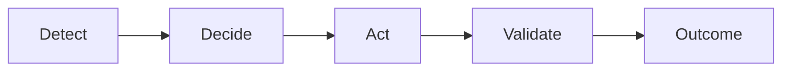



<h1>Self-healing infrastructure: From EDA to Orchestrated Automation</h1>

<i class="fas fa-layer-group" aria-hidden="true"></i> AIOps Use Case

> **Pattern guide, not a partner integration.**
>
> Observability tools in examples are interchangeable. Self-healing requires **controlled autonomy**: detect, decide, act, validate, with approvals where risk demands it.

## Overview

Known issues with proven fixes still wait in alert queues while someone diagnoses and runs remediation manually. **Self-healing infrastructure** closes the loop: observability detects failure, AI interprets the signal and selects or adapts remediation, automation executes approved workflows, and validation confirms recovery.

**Challenge:** Delay, inconsistency, and on-call toil for repeatable failures.

**Solved with AI + automation:** Observability platforms detect system-level failures. AI interprets signals and maps them to remediation. AAP executes with permissions and audit. Orchestrator coordinates validation and escalation.

**Business outcomes:** Faster recovery, consistent operations, scalable adaptability, controlled autonomy.

> **Buyer question:**
>
> What do we do when something breaks, end to end?

## Background

This is **Run** maturity in the AIOps use-case map. It builds on Crawl (enrichment, cost visibility) and Walk (curated remediation, drift enforcement). Entry points are primarily **event-initiated** from observability or ITSM.

## Solution

- **EDA** ingests alerts and events
- **AAP** executes remediation and validation playbooks
- **AI** for diagnosis and playbook selection (prefer curated library; see [Curated Automation Remediation](README-AIOps-Use-Case-04-Curated-Automation-Remediation.md))
- **AO** for approval, loops, and post-remediation validation workflows

### Who Benefits

| Persona | Challenge | What They Gain |
|---------|-----------|----------------|
| **SRE / on-call** | Repeated manual recovery steps | Automated detect-act-validate |
| **Automation architect** | Fragile one-off runbooks | Closed-loop, governed design |
| **IT leader** | MTTR and customer impact | Measurable recovery time |

## Prerequisites

- Ansible Automation Platform 2.5 or later
- Event-Driven Ansible connected to observability or ITSM
- Automation Orchestrator for full closed-loop workflows at Run maturity
- Approved remediation library (strongly recommended before autonomous act steps)

## EDA to AO adoption path

> **Coming soon:**
>
> Full walkthrough aligned to detect-decide-act-validate will be added. Until then, combine [Incident and Ticket Enrichment](README-AIOps-Use-Case-01-Incident-Ticket-Enrichment.md) Stages 1 and 4 with partner Solution Guides below.

### Stage 1: EDA + AAP only

Automated remediation for known alert types with validation playbooks.

### Stage 2: AI enrichment

AI-assisted diagnosis before human or automated act steps.

### Stage 3+: Automation Orchestrator

Closed-loop workflows with approval, loops, and validation nodes.

## Validation

| Symptom | Status |
|---------|--------|
| End-to-end scenario tests | Content in progress |

## Related Guides

- [Common AIOps Use Cases](aiops-use-cases.md)
- [AIOps automation with Ansible](README-AIOps.md)
- [Automated incident remediation with IBM Instana](README-Instana-AIOps.md)
- [AIOps with Splunk and Event-Driven Ansible](README-AIOps-Splunk-ITSI.md)
- [Curated Automation Remediation](README-AIOps-Use-Case-04-Curated-Automation-Remediation.md)

