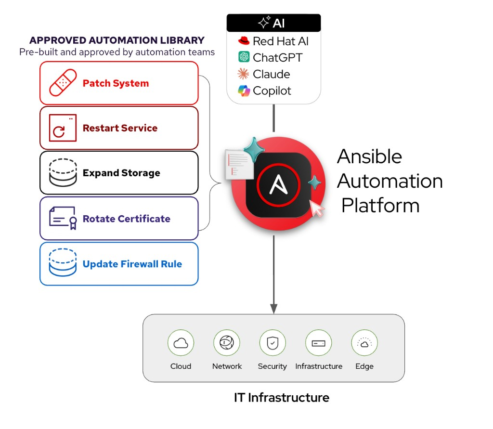
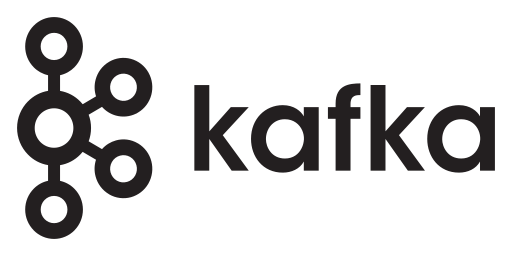
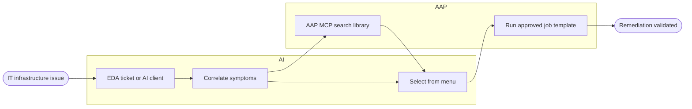


<div class="guide-header">

<h1>AIOps automation with Ansible</h1>

<span class="guide-type-badge guide-type-badge--solution"><i class="fas fa-check-circle" aria-hidden="true"></i> Solution Guide</span>

</div>

<style>
  div#toc {
    display: none;
  }
</style>

<div class="guide-hero-callout" role="img" aria-label="Ansible unlocks AIOps">
  
  <p class="guide-hero-callout__text">
    <span class="guide-hero-callout__ansible">Ansible</span>
    <span class="guide-hero-callout__unlocks">unlocks</span>
    <span class="guide-hero-callout__aiops">AIOps</span>
  </p>
</div>

## Overview

Traditional event-driven automation is **deterministic** -- for every event you want to handle, you write a specific rule and a corresponding action. Ten known failure scenarios means ten rules. A hundred means a hundred. This creates a **linear scaling problem**: as your IT environment grows in complexity, so does the number of rules you must author, test, and maintain.

| Approach | Events | Rules Required | Actions |
|----------|--------|---------------|---------|
| Traditional event-driven | 10 | 10 | 10 |
| Traditional event-driven | 100 | 100 | 100 |
| Traditional event-driven | 1,000 | 1,000 | 1,000 |
| **AIOps with Event-Driven Ansible (EDA)** | **1,000** | **Few rulebooks** (+ AI inference) | **Curated or governed** |

AIOps breaks this linear relationship by inserting **AI inference** between the event and **governed Ansible execution**. Most production paths **enrich** signals or **select from pre-approved job templates** rather than generating new playbooks at incident time. This guide maps operational patterns (Crawl/Walk/Run), partner integrations, and the **curated remediation** workflow most teams deploy. For the hands-on workshop pipeline, see [Self-healing infrastructure (use case 6)](README-AIOps-Use-Case-06-Self-Healing-Infrastructure.md).

<h2 id="background">Background</h2>

**AIOps** stands for *artificial intelligence* for IT operations. It refers both to a modern approach to managing IT operations and to the software systems that implement it. AIOps uses data science, big data, and machine learning to augment--or even automate--many traditionally manual IT tasks. The goal is to improve issue detection, root cause analysis, and system resolution.


 <a target="_blank" href="https://www.redhat.com/en/topics/ai/what-is-aiops">What is AIOps? – redhat.com</a>

There are three major parts of AIOps:

-  **Observability**
-  **Inference**
-  **Automation**


- **Observability**: Understanding the internal state of a system through logs, metrics, and traces.
   -  <a target="_blank" href="https://www.redhat.com/en/topics/devops/what-is-observability">What is observability? - redhat.com </a>
- **Inference**: Using AI models to make predictions based on new data.
   -  <a target="_blank" href="https://www.redhat.com/en/topics/ai/what-is-ai-inference">What is AI inference? - redhat.com</a>
- **Automation**: Automatically detect, respond to, and resolve IT issues.
   -  <a target="_blank" href="https://www.redhat.com/en/blog/aiops-and-ansible-automation-platform-where-ai-intelligence-meets-trusted-execution">AIOps and Ansible Automation Platform: Where AI intelligence meets trusted execution</a>

**Ansible Automation Platform** connects **observability** and **inference** to build **self-healing infrastructure.** Adoption is incremental: start with the loop that matches your maturity stage, then add inference, orchestration, and deeper Red Hat AI capabilities when a use case benefits from them.

### Where AIOps sits in the automation stack

Organizations usually run more than one kind of automation initiative at the same time. These are the common types -- not a ladder you must climb:

| Automation | What it does |
|------------|--------------|
| **Task-based** | Run known playbooks on a schedule or trigger |
| **Event-driven** | React to known conditions with pre-written rules |
| **Agent-driven** | Handle novel situations with real-time contextual judgment |

Most teams still lean heavily on **task-based** work, with **event-driven** adoption growing and **agent-driven** still emerging. **AIOps with Ansible** bridges event-driven and agent-driven: AI inference enriches signals or helps **select from an approved automation library**, then **AAP** executes with governance. That is Crawl/Walk in this guide -- not a fully autonomous agent on day one. Deeper Run autonomy still stays inside policy and the curated library.

<h2 id="solution">Solution</h2>

Ansible Automation Platform is the **trusted execution and orchestration layer** for AIOps. Partner observability, ITSM, and cloud tools supply signals; AAP and **EDA** close the loop with auditability and RBAC.

-  [YouTube video (~2 min)](https://youtu.be/a3fCHd2vTXU?si=L_5jGYZFtb3SzCJq)
-  [Please consider subscribing to the Ansible Team!](https://youtube.com/ansibleautomation?sub_confirmation=1)

### Who Benefits

| Persona | Challenge | What They Gain |
|---------|-----------|---------------|
|  **IT Ops Engineer / SRE** | Manually triaging alerts and repeatedly running the same diagnostics | Faster triage, AI-enriched context, and execution from **existing** approved job templates |
|  **Automation Architect** | Event-driven workflows that outgrow deterministic rules | Reference patterns for EDA, inference, curated remediation, and optional orchestration -- any observability or ITSM partner |
|  **IT Manager / Director** | Justifying AI investment while managing operational risk | Crawl/Walk/Run adoption, measurable MTTR gains, governance before autonomous Run |

<h2 id="common-aiops-use-cases">Common AIOps use cases</h2>

Six operational patterns for customer conversations. **AI identifies opportunities; automation delivers outcomes.** Each row below maps to **Crawl**, **Walk**, or **Run** (see maturity chips).

### How work starts


Each pattern has its own **AIOps Use Case** page (adoption path, partner links, validation). Pick a row below or open the [Common AIOps Use Cases hub](aiops-use-cases.md).

<div class="cards-track-section cards-track-section--use-cases">
<nav class="use-case-strip" aria-label="AIOps use cases">
<a class="use-case-strip__item" href="README-AIOps-Use-Case-01-Incident-Ticket-Enrichment.html">
  <span class="use-case-strip__num">1</span>
  <span class="use-case-strip__body">
    <span class="use-case-strip__title">Incident and Ticket Enrichment</span>
    <span class="use-case-strip__question">How do we stop wasting time just figuring out what happened?</span>
  </span>
  <span class="use-case-maturity-chip use-case-maturity-chip--crawl">Crawl</span>
</a>
<a class="use-case-strip__item" href="README-AIOps-Use-Case-02-Cost-Resource-Optimization.html">
  <span class="use-case-strip__num">2</span>
  <span class="use-case-strip__body">
    <span class="use-case-strip__title">Cost and Resource Optimization</span>
    <span class="use-case-strip__question">How do we identify wasted capacity before it becomes an operational problem?</span>
  </span>
  <span class="use-case-maturity-chip use-case-maturity-chip--crawl">Crawl</span>
</a>
<a class="use-case-strip__item" href="README-AIOps-Use-Case-03-Intelligent-Capacity-Orchestration.html">
  <span class="use-case-strip__num">3</span>
  <span class="use-case-strip__body">
    <span class="use-case-strip__title">Intelligent Capacity Orchestration</span>
    <span class="use-case-strip__question">How do we anticipate capacity needs across hybrid environments?</span>
  </span>
  <span class="use-case-maturity-chip use-case-maturity-chip--walk">Walk</span>
</a>
<a class="use-case-strip__item" href="README-AIOps-Use-Case-04-Curated-Automation-Remediation.html">
  <span class="use-case-strip__num">4</span>
  <span class="use-case-strip__body">
    <span class="use-case-strip__title">Curated Automation Remediation</span>
    <span class="use-case-strip__question">How do we remediate faster using automation teams already trust?</span>
  </span>
  <span class="use-case-maturity-chip use-case-maturity-chip--walk">Walk</span>
</a>
<a class="use-case-strip__item" href="README-AIOps-Use-Case-05-System-Drift-Policy-Enforcement.html">
  <span class="use-case-strip__num">5</span>
  <span class="use-case-strip__body">
    <span class="use-case-strip__title">System-Level Drift and Policy Enforcement</span>
    <span class="use-case-strip__question">How do we prevent slow failure and risk accumulation in the first place?</span>
  </span>
  <span class="use-case-maturity-chip use-case-maturity-chip--run">Run</span>
</a>
<a class="use-case-strip__item" href="README-AIOps-Use-Case-06-Self-Healing-Infrastructure.html">
  <span class="use-case-strip__num">6</span>
  <span class="use-case-strip__body">
    <span class="use-case-strip__title">Self-healing infrastructure</span>
    <span class="use-case-strip__question">What do we do when something breaks, end to end?</span>
  </span>
  <span class="use-case-maturity-chip use-case-maturity-chip--run">Run</span>
</a>
</nav>
</div>

<h2 id="prerequisites">Prerequisites</h2>

Requirements depend on which use case or partner guide you implement.

### Ansible Automation Platform

- **Ansible Automation Platform 2.5+** -- Required for enterprise **EDA** (baseline for this guide).
- **Ansible Automation Platform 2.7+** -- Required when you adopt **Automation orchestrator** (approvals, task agents, and logic steps) or the **AAP <a target="_blank" href="https://www.redhat.com/en/topics/ai/what-is-model-context-protocol-mcp">Model Context Protocol (MCP)</a> server** (library search and governed launch from an AI client).

<h3 id="event-sources">Event sources</h3>

You need at least one way for symptoms to reach automation -- a ticketing system, an observability platform, or both. Partner Solution Guides cover specific stacks; examples include:

- **Observability** -- IBM Instana, Splunk, and similar alert or metric sources that can feed EDA (webhook, plugin, or message bus)
- **ITSM / tickets** -- ServiceNow and similar systems where incidents or change requests start the loop
- **Optional inference** -- Red Hat AI or another OpenAI-compatible endpoint when you enrich signals before enrichment or selection

> **Tip:** Want event examples and vendor detail?
>
> Skip to [1. Detect](#1-detect) in the AIOps workflow -- event tables, observability tools, and message buses are walked through there.

### Red Hat Lightspeed (optional)

For CVE and Advisor remediations, **Red Hat Lightspeed** publishes **curated** playbooks your teams promote into the approved library. That is not **Automation code assistant** (authoring-time drafts). See [Trusted sources for the approved library](#trusted-playbook-sources).

> **Terminology update -- Lightspeed rebranding.**
>
> Red Hat has consolidated its AI-powered services under the **Lightspeed** brand. **Ansible Lightspeed Code Assistant** is now **Automation code assistant** (supports Gemini, Red Hat AI, or IBM watsonx). **Ansible Lightspeed Intelligent Assistant** is now **Automation intelligent assistant**. **Red Hat Insights** (console.redhat.com) is now **Red Hat Lightspeed**. The functionality is the same -- only the branding has changed. This guide uses both old and new names where they appear in existing code and screenshots.

<h2 id="aiops-workflow">AIOps workflow</h2>

The **default production pattern** is **curated automation remediation**: when an incident arrives, the AI assistant uses the **AAP MCP server** to **search** Ansible Automation Platform for **pre-approved** job templates and workflows, **selects** the best match (like a menu), and requests a **governed run**. Nothing new is invented at incident time, which keeps audit trails, RBAC, and change control intact.

> **Why select instead of generate?**
>
> Generating playbooks from an alert introduces **unreviewed change** every time the same symptom recurs. Teams already maintain trusted automation in AAP. MCP exposes that library to the AI client so inference **chooses** from approved options instead of authoring fixes from thin air.

**EDA** is included in Ansible Automation Platform. The four sections below follow the same shape as the hands-on workshop pipeline, mapped to the **production curated path**:

1. **[Detect](#1-detect)** -- observability, ITSM, or an operator surfaces a symptom.
2. **[MCP search](#2-mcp-search)** -- the AI client lists approved job templates and workflows in AAP.
3. **[Correlate and select](#3-correlate-and-select)** -- inference picks from the library (or a short list for approval).
4. **[Execute approved job](#4-execute-approved-job)** -- governed run with guardrails and validation.



<h2 id="1-detect">1. Detect</h2>
<a id="event-intake-reference"></a>

Something must **detect** a symptom and reach EDA, an ITSM ticket, or an AI client before MCP search runs. The tables below are vendor-neutral patterns -- not a checklist to deploy all at once.

### What can trigger automation?

EDA is versatile and pluggable -- Ansible Automation Platform can react to many event shapes. Partner Solution Guides show specific integrations; use these patterns when designing rulebooks:

<h4 id="img-srchttpscdnjsdelivrnetghtwittertwemoji1402assets72x721f525png-width20-stylevertical-aligntext-bottom-application-level-events"></h4>

####  Application-Level Events

| Event | Source | Example Response |
|-------|--------|------------------|
| **application service crash or stopped** | `systemd`, `monit`, or Prometheus alert | Restart, notify on Slack, check last logs via journald |
| **High 5xx error rate in NGINX/Apache** | Web server logs, Prometheus metrics | Trigger Ansible to roll back a recent deployment or redirect traffic |
| **Application log shows exception spike** | Log aggregator (ELK, Loki, Datadog) | Run Ansible remediation that restarts service and clears cache |
| **Web app fails readiness check** | Kubernetes liveness/readiness probe | Reboot pod, scale another replica, or notify developer team |
| **API latency exceeds threshold** | APM tool (e.g., Dynatrace, Instana) | Provision more backend instances or restart slow services |

<h4 id="img-srchttpscdnjsdelivrnetghtwittertwemoji1402assets72x722699png-width20-stylevertical-aligntext-bottom-infrastructure--platform-events"></h4>

####  Infrastructure & Platform Events

| Event | Source | Example Response |
|-------|--------|------------------|
| **Disk space usage > 90%** | Prometheus Node Exporter, Zabbix | Clean temp files, archive logs, or extend volume |
| **High CPU load on EC2 or VM** | CloudWatch, Telegraf, etc. | Scale out VM set or move workloads |
| **OOM Kill in container** | Kubernetes Events | Restart pod, notify engineering, increase memory limits |
| **Node goes NotReady in Kubernetes** | K8s API | Cordon node, reassign pods, and open a ticket |
| **Filesystem becomes read-only** | `dmesg`, audit logs, OS-level alerts | Unmount and remount or migrate app to another host |

<h4 id="img-srchttpscdnjsdelivrnetghtwittertwemoji1402assets72x721f310png-width20-stylevertical-aligntext-bottom-network--security-events"></h4>

####  Network & Security Events

| Event | Source | Example Response |
|-------|--------|------------------|
| **Interface down / Link failure** | SNMP traps, syslog | Notify NOC, run Ansible playbook to reroute traffic |
| **Unauthorized SSH attempt detected** | Fail2Ban, syslog, SIEM | Block IP, rotate SSH keys, notify SOC |
| **SSL certificate expiring soon** | Certbot, monitoring tool | Auto-renew with Let's Encrypt, push new cert with Ansible |
| **DNS resolution failures** | `systemd-resolved`, DNS logs | Switch DNS provider or fix `/etc/resolv.conf` |

<h4 id="img-srchttpscdnjsdelivrnetghtwittertwemoji1402assets72x721f4a1png-width20-stylevertical-aligntext-bottomobservability-driven-triggers"></h4>

#### Observability-Driven Triggers

| Event | Source | Example Response |
|-------|--------|------------------|
| **SLO breach warning (latency or error rate)** | SRE observability tool | Pre-emptively scale or rollback new features |
| **New critical error introduced in logs post-deploy** | ELK, Honeycomb, etc. | Rollback deployment via Ansible |
| **User reports spike via feedback or ticket** | ITSM tools | Use AI to correlate symptoms, gather diagnostics, and kick off a fix |

### Observability and event sources

Examples of tools that can feed EDA directly or via a bus (see [Common AIOps use cases](#common-aiops-use-cases) and partner guides):

<table class="guide-table-event-sources">
<thead>
<tr><th>Tool</th><th>Description</th><th>Hub</th><th>Solution guide</th></tr>
</thead>
<tbody>
<tr>
<td><a id="filebeat"></a><span class="guide-tool-logo-set"></span><strong>Filebeat</strong></td>
<td>Filebeat is a lightweight, open-source log shipper from Elastic that forwards logs from end-systems to a message aggregator. It is not an observability platform on its own -- it requires a message bus like Kafka to transport events to EDA. Workshops often use Filebeat because it is free, low-overhead, and easy to deploy in lab environments.</td>
<td>--</td>
<td>--</td>
</tr>
<tr>
<td><a id="ibm-instana"></a><span class="guide-tool-logo-set"></span><strong>IBM Instana</strong></td>
<td>IBM Instana provides real-time observability across hybrid and multicloud environments with automatic change detection, end-to-end tracing, and context-rich alerts. Its built-in anomaly detection and contextual correlation make it a natural event source for EDA rulebooks -- Instana can trigger automation workflows directly or through a message bus like Kafka.</td>
<td><a target="_blank" href="https://console.redhat.com/ansible/automation-hub/repo/published/ibm/instana/">Instana</a></td>
<td><a href="README-Instana-AIOps.html">Instana AIOps</a></td>
</tr>
<tr>
<td><a id="splunk"></a><span class="guide-tool-logo-set"></span><strong>Cisco Splunk</strong></td>
<td>Cisco Splunk (Splunk Enterprise / Splunk Cloud) ingests logs, metrics, traces, and events from virtually any source, providing a centralized view of system health across complex IT environments. Its machine learning and anomaly detection capabilities can proactively surface issues, making it an ideal trigger source for EDA-driven remediation workflows -- including network domains such as Cisco infrastructure.</td>
<td><a target="_blank" href="https://console.redhat.com/ansible/automation-hub/namespaces/splunk/">Splunk</a></td>
<td><a href="README-AIOps-Splunk-ITSI.html">Splunk and EDA</a></td>
</tr>
</tbody>
</table>

> **Tip:** Skip Filebeat on Linux hosts?
>
> For RHEL and other Linux systems, **journald** or **syslog** can feed a message bus (or an EDA-compatible source) without Filebeat. Filebeat is a convenient lab shipper -- not a hard requirement when native OS logging already reaches your bus.

### Message queues and EDA (optional)

Message queues are optional depending on the observability tool. For example IBM Instana can work directly with EDA to trigger automation jobs, or it can work with a message queue like Apache Kafka. Here are some examples of other message queues that Ansible Automation Platform works with:

<table class="guide-table-event-sources">
<thead>
<tr><th>Tool</th><th>Description</th><th>Hub</th><th>Solution guide</th></tr>
</thead>
<tbody>
<tr>
<td><a id="aws-sqs"></a><span class="guide-tool-logo-set"></span><strong>AWS SQS</strong></td>
<td>Amazon SQS (Simple Queue Service) is a managed message queuing service that decouples event producers from consumers. In an AIOps workflow, observability tools or AWS CloudWatch can publish events to an SQS queue, and EDA subscribes to that queue to trigger automation.</td>
<td><a target="_blank" href="https://console.redhat.com/ansible/automation-hub/repo/published/amazon/aws/">AWS</a></td>
<td><a href="README-SQS.html">AWS SQS and EDA</a></td>
</tr>
<tr>
<td><a id="azure-service-bus"></a><span class="guide-tool-logo-set"></span><strong>Azure Service Bus</strong></td>
<td>Azure Service Bus is a fully managed enterprise messaging service with message queuing and publish-subscribe capabilities. EDA can subscribe to Service Bus topics or queues to detect events from Azure resources and third-party systems, making it a natural fit for cloud-centric AIOps workflows.</td>
<td><a target="_blank" href="https://console.redhat.com/ansible/automation-hub/repo/published/ansible/eda/content/eda%2Fplugins%2Fevent_source/azure_service_bus/">Azure</a></td>
<td><a href="README-AIOps-Azure-Service-Bus.html">Azure Service Bus</a></td>
</tr>
<tr>
<td><a id="kafka"></a><span class="guide-tool-logo-set"></span><strong>Kafka</strong></td>
<td>Apache Kafka is a high-throughput, fault-tolerant event streaming platform that collects telemetry data, logs, alerts, and state changes from diverse sources. EDA listens to Kafka topics for specific patterns and triggers remediation workflows. Kafka's ability to decouple producers and consumers makes it ideal for scaling AIOps pipelines across large environments.</td>
<td><a target="_blank" href="https://console.redhat.com/ansible/automation-hub/repo/published/ansible/eda/content/eda%2Fplugins%2Fevent_source/kafka/">Kafka</a></td>
<td>--</td>
</tr>
</tbody>
</table>

Example rulebook for Kafka:

```yaml
---
- name: Web app issue
  hosts: all
  sources:
   - ansible.eda.kafka:
       host: service1
       port: 9092
       topic: httpd-error-logs

  rules:
    - name: apache shutdown detected
      condition: event.body.message is search("shutting down")
      action:
        run_workflow_template:
          organization: "Default"
          name: "{{ workflow_template_name | default('Curated enrichment workflow') }}"

    - name: show event messages
      condition: event.body.message is defined
      action:
        debug:
          msg: "{{ event.body.message }}"

```

<h2 id="2-mcp-search">2. MCP search</h2>

After **Detect**, the AI assistant (or an enrichment workflow that hands off to a client) queries Ansible Automation Platform through the **AAP MCP server**. MCP returns **labeled job templates and workflows** from the approved library -- fix permissions, increase storage, patch a CVE, restart a service, and similar -- scoped to the operator's RBAC. Nothing launches yet; this stage only builds the menu for correlation.

| MCP read path | What you get |
|---------------|--------------|
| **Search job templates** | Names, descriptions, and organization scope for symptom-matching automation |
| **Search workflows** | Multi-step governed sequences (surveys, approvals, child jobs) |
| **RBAC boundary** | Empty or partial results if the token cannot see or run candidates |

Work can also start from an operator pasting incident context into an AI client without EDA; MCP search works the same way once context is available.

> **Tip:** Connect MCP.
>
> - [Ansible DevTools: connect to AAP MCP](README-Ansible-DevTools.md#connecting-to-ansible-automation-platform) -- gateway setup and toolsets
> - [Curated Automation Remediation (use case 4)](README-AIOps-Use-Case-04-Curated-Automation-Remediation.md) -- full Walk pattern

<h2 id="3-correlate-and-select">3. Correlate and select</h2>
<a id="4-curated-automation-remediation-walk"></a>

Curated automation provides a practical foundation for AIOps with Red Hat Ansible Automation Platform (AAP). Remediation can begin with an observability event through Event-Driven Ansible, an ITSM ticket, or an operator using an AI client such as Cursor, Claude Code, ChatGPT, or Copilot. AI capabilities from Red Hat AI or another platform help correlate signals and recommend actions, while AAP executes approved automation content to deliver controlled, repeatable remediation.

| Step | What happens |
|------|----------------|
| **1** | An **IT infrastructure issue** fires (EDA rulebook, Splunk or Instana alert, ServiceNow ticket, scheduled check, or human request). |
| **2** | The **AI assistant** asks AAP, via **MCP**, what remediation automation is available for this class of problem. |
| **3** | **AAP** returns the **approved automation library** -- labeled job templates and workflows (fix permissions, increase storage, correct configuration, patch CVE, and similar). |
| **4** | The AI **correlates** incident context to one library entry (or a short ranked list for human approval). |
| **5** | The AI **requests a run** of the selected template (for example, **Increase storage**) through MCP with the operator's RBAC. |
| **6** | **AAP executes** the approved automation and reports success back to observability or ITSM. |

Steps 1-2 align with [1. Detect](#1-detect) and [2. MCP search](#2-mcp-search). Steps 4-5 are the core of **Correlate and select**; step 6 is [4. Execute approved job](#4-execute-approved-job).




<h3 id="trusted-playbook-sources">Trusted sources for the approved library</h3>

Walk and Run assume automation already lives in AAP as reviewed job templates and workflows. Common sources:

| Source | Description |
|--------|-------------|
| **CVE Remediation (Red Hat Lightspeed)** | <a target="_blank" href="https://console.redhat.com">Red Hat Lightspeed</a> (formerly Red Hat Insights) identifies vulnerabilities affecting your RHEL fleet and **publishes Red Hat-curated remediation playbooks** tied to errata and the Security Data API. This is expert-authored, Red Hat-approved content -- **not** LLM output from Automation code assistant. |
| **Advisor Recommendations (Red Hat Lightspeed)** | Lightspeed flags misconfigurations and best-practice violations (e.g., SELinux policy issues, SSH configurations that won't survive a reboot) and **provides curated Advisor remediation playbooks** to fix them proactively. Think of CVEs as *reactive* -- patching known vulnerabilities. Advisor recommendations are *proactive* -- fixing misconfigurations before they become incidents. |
| **Pre-approved AAP library** | Job templates and workflows your teams already test, review, and run -- the default source for Walk curated remediation and Run self-healing via MCP. |
| **RHEL System Roles** | Officially supported, pre-built Ansible roles shipped with RHEL that provide a stable, version-independent interface for common configuration tasks (NTP, networking, storage, SELinux, firewall). |
| **AI-assisted authoring (Automation code assistant)** | Developers use Automation code assistant in the IDE to accelerate playbook **authoring**. Humans review, test, and promote content into the approved library -- not incident-time generation. |

> **Human-in-the-loop is what makes it production-ready.**
>
> Whether a playbook came from **Red Hat Lightspeed** (curated CVE or Advisor content), was **drafted with Automation code assistant** and reviewed by your team, or was hand-crafted, the same promotion process applies: Git as source of truth, project sync in AAP, Job Templates with guardrails (credentials, inventory limits, surveys), and optional approval gates. The IDE is where review happens for AI-assisted authoring; AAP is where gatekeeping happens.

> **Tip:** Not ready to run automation yet?
>
> Stop after correlate/select and **notify** only (chat or ITSM). See [Incident and Ticket Enrichment](README-AIOps-Use-Case-01-Incident-Ticket-Enrichment.md).

<h2 id="4-execute-approved-job">4. Execute approved job</h2>

The AI client (or workflow) **launches** the selected job template or workflow through MCP with the operator's RBAC. AAP executes the approved automation, records audit history, and should feed results back to observability or ITSM. Add a **validation** job or observability check before closing the incident.

### Production guardrails

Before high-impact runs, teams typically enforce:

| Recommendation | What to do |
|----------------|------------|
| **Library-first** | Expose only approved job templates and workflows through MCP; grow the library before expanding autonomy |
| **Approvals** | Require a human or Automation orchestrator gate before launch until policy clearly allows auto-run |
| **Validation** | Confirm recovery with a post-run job or observability check before closing the incident |
| **Policy** | Use surveys, inventory limits, and credential scope; add <a target="_blank" href="https://www.redhat.com/en/technologies/management/ansible/automated-policy-as-code">Automated Policy as Code</a> where required |

<h2 id="validation">Validation</h2>

Validate the **curated remediation** path end to end. Partner Solution Guides add tool-specific steps; this table is the pattern-level checklist.

| Stage | What to verify | Success indicator |
|-------|----------------|-------------------|
| **1. Detect** | Event, ticket, or operator request reaches automation | EDA rulebook activation **Running** with matching events, or MCP client receives incident context |
| **2. MCP library search** | AI client queries AAP with operator RBAC | MCP returns labeled job templates or workflows relevant to the symptom class |
| **3. Select and approve** | AI correlates to one library entry (or short list) | Selected template matches runbook intent; approval recorded if required |
| **4. Execute and validate** | Governed job run completes | Job success in AAP; observability or validation playbook shows service recovered |

### Troubleshooting (curated path)

Most failures on the curated path show up as **library gaps**, **wrong selection**, or **RBAC** on execute.

| Symptom | Likely cause | Fix |
|---------|--------------|-----|
| MCP returns empty library | No job templates tagged or scoped for the symptom | Publish approved templates; verify MCP token RBAC and organization |
| AI selects wrong template | Weak incident context or overlapping library entries | Improve enrichment at Crawl; tighten template names or surveys; require human approval at Walk |
| Job launch denied | RBAC or credential scope on MCP token | Use a token that may execute the selected template on target inventory |
| Job succeeded but alert persists | Validation playbook missing or wrong host group | Add post-run validation job; confirm observability feedback loop in partner guide |

<h2 id="aiops-maturity-path">AIOps Maturity Path</h2>

Progress from read-only enrichment toward governed closed-loop automation. The [AIOps workflow](#aiops-workflow) sections above map **Detect** through **Execute**; the hub table lists all six use-case patterns.

| Maturity | Use Cases | What AI Does |
|----------|-----------|-------------|
|  **Crawl** | Incident & Ticket Enrichment, Cost & Resource Optimization | AI **interprets** operational signals and attaches context -- no changes to systems |
|  **Walk** | Curated Automation Remediation, Intelligent Capacity Orchestration | AI **selects** from pre-approved automation -- proven playbooks, governed execution |
|  **Run** | [Self-healing infrastructure](README-AIOps-Use-Case-06-Self-Healing-Infrastructure.md), [System-Level Drift and Policy Enforcement](README-AIOps-Use-Case-05-System-Drift-Policy-Enforcement.md) | Closed-loop **approved library** execution with policy and validation |

> **AIOps is the outcome. Agentic is a capability.**
>
> Agentic workflows -- where AI plans, uses tools, reflects on results, and iterates -- can enhance any stage of this journey. But AIOps does not require agentic capabilities to deliver value. A deterministic EDA rulebook that enriches a ServiceNow ticket is AIOps at the Crawl stage. A fully autonomous agent that reasons about OSPF failures is AIOps at the Run stage. Start where you are.

**Crawl** (enrichment / notify only): [Incident and Ticket Enrichment](README-AIOps-Use-Case-01-Incident-Ticket-Enrichment.md), [ServiceNow ITSM Ticket Enrichment Automation](README-ServiceNow-ITSM.md), [AIOps with Splunk and Event-Driven Ansible](README-AIOps-Splunk-ITSI.md).

**Run** (closed loop after stage 4): [System-Level Drift and Policy Enforcement](README-AIOps-Use-Case-05-System-Drift-Policy-Enforcement.md), [Self-healing infrastructure](README-AIOps-Use-Case-06-Self-Healing-Infrastructure.md).

<h2 id="related-guides">Related Guides</h2>

-  [Hands-On AIOps Workshop](https://rhpds.github.io/ai-driven-automation-showroom/modules/index.html)
- [Automated Incident Remediation with IBM Instana](README-Instana-AIOps.md)
- [Unlock AIOps with ServiceNow LEAP and Ansible MCP server](README-AIOps-ServiceNow.md)
- [AIOps with Splunk and Event-Driven Ansible](README-AIOps-Splunk-ITSI.md)
- [AIOps with AWS SQS and Event-Driven Ansible](README-SQS.md)
- [Event-Driven Remediation with Azure Service Bus](README-AIOps-Azure-Service-Bus.md)

---

## Summary

With this framework, teams move from manual triage toward governed AIOps: enrich signals at **Crawl**, route to **pre-approved automation** at **Walk**, and close the loop at **Run** with policy, validation, and trust in the automation library. Ansible Automation Platform remains the execution layer for partner observability paths, self-hosted **inference** for enrichment, and **Red Hat Lightspeed curated remediations**.

---

<h2 id="key-terms">Key Terms</h2>

Reference for Ansible collections in this guide, including config-as-code and partner integrations. Partner Solution Guides add their own collections on each page. For **Red Hat Lightspeed curated remediations** versus **Automation code assistant** authoring-time drafts, see [Trusted sources for the approved library](#trusted-playbook-sources).

<div class="key-terms-group">

<h3 id="key-terms-collections">Ansible collections</h3>

<dl class="key-terms-glossary">

<dt><a target="_blank" href="https://console.redhat.com/ansible/automation-hub/repo/published/ansible/eda/">ansible.eda</a></dt>
<dd>Certified collection for Event-Driven Ansible rulebooks, event sources, and filters (Kafka, webhooks, and partner plugins).
<span class="key-terms-detail">Baseline for event-driven AIOps paths in this guide and in partner Solution Guides.</span></dd>

<dt><a target="_blank" href="https://console.redhat.com/ansible/automation-hub/repo/published/ansible/controller/">ansible.controller</a></dt>
<dd>Certified collection for Ansible Automation Platform configuration as code: job templates, workflows, surveys, credentials, and RBAC.
<span class="key-terms-detail">Baseline for governed execution regardless of observability or ITSM partner.</span></dd>

<dt><a target="_blank" href="https://console.redhat.com/ansible/automation-hub/repo/published/ansible/scm/">ansible.scm</a></dt>
<dd>Certified collection for Git operations against playbook projects.
<span class="key-terms-detail">Used in the <a href="README-AIOps-Use-Case-06-Self-Healing-Infrastructure.html#workshop-run-pipeline">UC06 workshop pipeline</a> for Git promotion.</span></dd>

<dt>Partner collections</dt>
<dd>Collections named on each partner Solution Guide (for example <code>servicenow.itsm</code>, IBM Instana, Splunk or EDA integrations).
<span class="key-terms-detail">Install only for the integration you are implementing; see <a href="#event-sources">Event sources</a> in Prerequisites.</span></dd>

<dt><a target="_blank" href="https://console.redhat.com/ansible/automation-hub/repo/validated/infra/ai">infra.ai</a> and <a target="_blank" href="https://console.redhat.com/ansible/automation-hub/repo/published/redhat/ai">redhat.ai</a></dt>
<dd>Optional validated and certified collections for <strong>self-hosted Red Hat AI</strong> on your infrastructure.
<span class="key-terms-detail">Automate provisioning GPU capacity and serving models with RHEL AI and InstructLab. They do not replace generic OpenAI-compatible APIs or partner-hosted inference. See <a href="README-IA.html">AI Infrastructure automation with Ansible</a> for a full walkthrough.</span></dd>

</dl>

</div>

---

## Next Steps

| | |
|---|---|
|  <a target="_blank" href="https://www.redhat.com/en/technologies/management/ansible/trial"><strong>Try Ansible Automation Platform</strong></a> | Start a free 60-day trial and build your first automation workflows |
|  <a target="_blank" href="https://www.redhat.com/en/services/consulting"><strong>Red Hat Consulting</strong></a> | Work with Red Hat experts to design, implement, and scale AIOps automation tailored to your environment |
|  <a target="_blank" href="https://www.redhat.com/en/services/training-and-certification"><strong>Training and Certification</strong></a> | Build team skills with hands-on courses and industry-recognized certifications |

---



