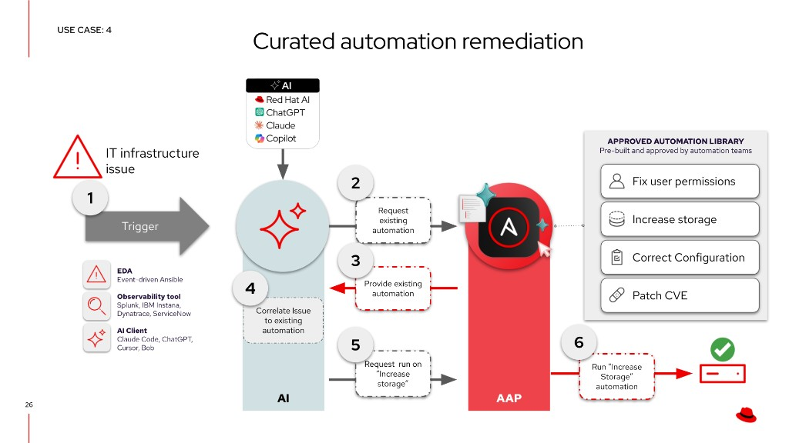



<h1>AIOps automation with Ansible</h1>

<i class="fas fa-check-circle" aria-hidden="true"></i> Solution Guide

  
  

    Ansible
    unlocks
    AIOps
  

## Overview

Traditional event-driven automation is **deterministic** -- for every event you want to handle, you write a specific rule and a corresponding action. Ten known failure scenarios means ten rules. A hundred means a hundred. This creates a **linear scaling problem**: as your IT environment grows in complexity, so does the number of rules you must author, test, and maintain.

| Approach | Events | Rules Required | Actions |
|----------|--------|---------------|---------|
| Traditional EDA | 10 | 10 | 10 |
| Traditional EDA | 100 | 100 | 100 |
| Traditional EDA | 1,000 | 1,000 | 1,000 |
| **AIOps with EDA** | **1,000** | **Few rulebooks** (+ AI inference) | **Curated or governed** |

AIOps breaks this linear relationship by inserting **AI inference** between the event and **governed Ansible execution**. Most production paths **enrich** signals or **select from pre-approved job templates** rather than generating new playbooks at incident time. This guide maps operational patterns (Crawl/Walk/Run), partner integrations, and the **curated remediation** workflow most teams deploy in production. Advanced workshop codegen is documented on [Self-healing infrastructure (use case 6)](README-AIOps-Use-Case-06-Self-Healing-Infrastructure.md), not here.

> **Where does AIOps fit?**
>
> The industry is moving through three generations of IT automation: **task-based** automation (running known playbooks on a schedule or trigger), **event-driven** automation (reacting to known conditions with pre-written rules), and **agent-driven** automation (handling novel situations with real-time contextual judgment). Most organizations today rely heavily on task-based automation, with event-driven adoption growing and agent-driven still emerging. AIOps with Ansible bridges event-driven and agent-driven by using AI to handle situations you *didn't* explicitly write rules for, without requiring a fully autonomous agent.

<h2 id="background"></h2>

## Background

**AIOps** stands for *artificial intelligence* for IT operations. It refers both to a modern approach to managing IT operations and to the software systems that implement it. AIOps uses data science, big data, and machine learning to augment--or even automate--many traditionally manual IT tasks. The goal is to improve issue detection, root cause analysis, and system resolution.

 <a target="_blank" href="https://www.redhat.com/en/topics/ai/what-is-aiops">What is AIOps? – redhat.com</a>

There are three major parts of AIOps:

-  **Observability**
-  **Inference**
-  **Automation**

- **Observability**: Understanding the internal state of a system through logs, metrics, and traces.
   -  <a target="_blank" href="https://www.redhat.com/en/topics/devops/what-is-observability">What is observability? - redhat.com </a>
- **Inference**: Using AI models to make predictions based on new data.
   -  <a target="_blank" href="https://www.redhat.com/en/topics/ai/what-is-ai-inference">What is AI inference? - redhat.com</a>
- **Automation**: Automatically detect, respond to, and resolve IT issues.
   -  <a target="_blank" href="https://www.redhat.com/en/blog/aiops-and-ansible-automation-platform-where-ai-intelligence-meets-trusted-execution">AIOps and Ansible Automation Platform: Where AI intelligence meets trusted execution</a>

**Ansible Automation Platform** connects **observability** and **inference** to build **self-healing infrastructure.** Adoption is incremental: start with the loop that matches your maturity stage, then add inference, orchestration, and deeper Red Hat AI capabilities when a use case benefits from them.

> **Terminology update -- Lightspeed rebranding.**
>
> Red Hat has consolidated its AI-powered services under the **Lightspeed** brand. **Ansible Lightspeed Code Assistant** is now **Automation code assistant** (supports Gemini, Red Hat AI, or IBM watsonx). **Ansible Lightspeed Intelligent Assistant** is now **Automation intelligent assistant**. **Red Hat Insights** (console.redhat.com) is now **Red Hat Lightspeed**. The functionality is the same -- only the branding has changed. This guide uses both old and new names where they appear in existing code and screenshots.

<h2 id="solution"></h2>

## Solution

Ansible Automation Platform is the **trusted execution and orchestration layer** for AIOps. Partner observability, ITSM, and cloud tools supply signals; AAP and Event-Driven Ansible close the loop with auditability and RBAC.

<table class="guide-table-capability-layers">
<thead>
<tr><th>Layer</th><th>Components</th><th>Role</th></tr>
</thead>
<tbody>
<tr><td><strong>Core</strong></td><td>Ansible Automation Platform, Event-Driven Ansible</td><td>Governed job execution, rulebooks, workflows</td></tr>
<tr><td><strong>Common</strong></td><td>Customer observability or ITSM (Splunk, Instana, ServiceNow, Azure, AWS, and others), inference or MCP as needed</td><td>Events, tickets, enrichment context</td></tr>
<tr><td><strong>Optional</strong></td><td>Red Hat Lightspeed (CVE/Advisor content), self-hosted Red Hat AI, Automation Orchestrator, AAP MCP server</td><td>Deeper AI, multi-step orchestration, ITSM intelligence</td></tr>
</tbody>
</table>

Capabilities compose by **maturity and use case**, not as one preset bundle. The table shows where Red Hat and partner offerings fit: **Core** execution and Event-Driven Ansible first, then **Common** observability, ITSM, and inference when enrichment or triage needs them, then **Optional** depth (self-hosted Red Hat AI, Lightspeed content, Automation Orchestrator, MCP) as patterns in [Common AIOps use cases](#common-aiops-use-cases) call for them.

-  [YouTube video (~2 min)](https://youtu.be/a3fCHd2vTXU?si=L_5jGYZFtb3SzCJq)
-  [Please consider subscribing to the Ansible Team!](https://youtube.com/ansibleautomation?sub_confirmation=1)

<h2 id="common-aiops-use-cases"></h2>

## Common AIOps use cases

Six operational patterns for customer conversations. **AI identifies opportunities; automation delivers outcomes.** Each row below maps to **Crawl**, **Walk**, or **Run** (see maturity chips). Use cases **5** and **6** are both **Run** but different buyer questions (drift and policy vs self-healing); partner depth lives on each linked page.

### How work starts

Each pattern has its own **AIOps Use Case** page (adoption path, partner links, validation). Pick a row below or open the [Common AIOps Use Cases hub](aiops-use-cases.md).

<nav class="use-case-strip" aria-label="AIOps use cases">
<a class="use-case-strip__item" href="README-AIOps-Use-Case-01-Incident-Ticket-Enrichment.md">
  1
  
    Incident and Ticket Enrichment
    How do we stop wasting time just figuring out what happened?
  
  Crawl
</a>
<a class="use-case-strip__item" href="README-AIOps-Use-Case-02-Cost-Resource-Optimization.md">
  2
  
    Cost and Resource Optimization
    How do we identify wasted capacity before it becomes an operational problem?
  
  Crawl
</a>
<a class="use-case-strip__item" href="README-AIOps-Use-Case-03-Intelligent-Capacity-Orchestration.md">
  3
  
    Intelligent Capacity Orchestration
    How do we anticipate capacity needs across hybrid environments?
  
  Walk
</a>
<a class="use-case-strip__item" href="README-AIOps-Use-Case-04-Curated-Automation-Remediation.md">
  4
  
    Curated Automation Remediation
    How do we remediate faster using automation teams already trust?
  
  Walk
</a>
<a class="use-case-strip__item" href="README-AIOps-Use-Case-05-System-Drift-Policy-Enforcement.md">
  5
  
    System-Level Drift and Policy Enforcement
    How do we prevent slow failure and risk accumulation in the first place?
  
  Run
</a>
<a class="use-case-strip__item" href="README-AIOps-Use-Case-06-Self-Healing-Infrastructure.md">
  6
  
    Self-healing infrastructure
    What do we do when something breaks, end to end?
  
  Run
</a>
</nav>

### Who Benefits

| Persona | Challenge | What They Gain |
|---------|-----------|---------------|
|  **IT Ops Engineer / SRE** | Manually triaging alerts and repeatedly running the same diagnostics | Faster triage, AI-enriched context, and execution from **existing** approved job templates |
|  **Automation Architect** | Event-driven workflows that outgrow deterministic rules | Reference patterns for EDA, inference, curated remediation, and optional orchestration -- any observability or ITSM partner |
|  **IT Manager / Director** | Justifying AI investment while managing operational risk | Crawl/Walk/Run adoption, measurable MTTR gains, governance before autonomous Run |

<h2 id="prerequisites"></h2>

## Prerequisites

### Ansible Automation Platform

- **Ansible Automation Platform 2.5+** -- Required for enterprise Event-Driven Ansible support.

### Baseline automation content

Most AIOps paths need **Event-Driven Ansible** and **Ansible Automation Platform** job execution only:

- **`ansible.eda`** -- rulebooks, event sources, and filters (see [Automation Hub](https://console.redhat.com/ansible/automation-hub/repo/published/ansible/eda/))
- **`ansible.controller`** -- job templates, workflows, surveys, and RBAC as code (see [Automation Hub](https://console.redhat.com/ansible/automation-hub/repo/published/ansible/controller/))

Partner Solution Guides list additional collections (`servicenow.itsm`, IBM Instana, Splunk, and others).

> **Tip:** Collections reference
>
> Hub links, optional self-hosted inference collections, and when to use them are in [Key Terms](#key-terms) at the end of this guide.

### External Systems

| System | Required | Examples |
|--------|----------|----------|
| Observability or ITSM (pattern-dependent) | Yes for event/ticket flows | IBM Instana, Splunk, ServiceNow, Dynatrace, Prometheus, Azure, AWS |
| Message queue or event bus | Optional | Kafka, AWS SQS, Azure Service Bus (depends on partner) |
| AI inference endpoint | Optional | Red Hat AI, partner AI, or any OpenAI-compatible API for enrichment |
| Automation code assistant | Optional | IDE **authoring-time** only; optional UC06 advanced lab -- not Walk curated remediation |
| Red Hat Lightspeed | Recommended | CVE and Advisor remediation content via console.redhat.com |
| Git repository | Optional | Required for Git-backed projects; UC06 workshop appendix uses promotion flow |
| Automation Orchestrator | Optional | Multi-step orchestration, approvals, AI agent nodes (see UC01 deep-dive) |
| AAP MCP server | Recommended at Walk | Query job templates and workflows, launch governed runs; also ServiceNow LEAP and Lightspeed MCP |
| Chat or ITSM tool | Recommended | Mattermost, Slack, ServiceNow |

<h2 id="aiops-workflow"></h2>

## Curated remediation workflow

The **default production pattern** is **curated automation remediation** at **Walk** maturity: when an incident arrives, the AI assistant uses the **AAP MCP server** to **search** Ansible Automation Platform for **pre-approved** job templates and workflows, **selects** the best match (like a menu), and requests a **governed run**. Nothing new is invented at incident time, which keeps audit trails, RBAC, and change control intact.

> **Why select instead of generate?**
>
> Generating playbooks from an alert introduces **unreviewed change** every time the same symptom recurs. Teams already maintain trusted automation in AAP. MCP exposes that library to the AI client so inference **chooses** from approved options instead of authoring fixes from thin air.

**Event-Driven Ansible** is included in Ansible Automation Platform. The sections below name EDA separately where rulebooks are the event **input** path and AAP job templates are the governed **output**.

<h3 id="4-curated-automation-remediation-walk"></h3>

### Reference architecture: curated automation remediation (Walk)

Use case **4 -- Curated automation remediation** is the reference loop for most customer conversations. Work can start from observability (EDA), an ITSM ticket, or an operator using an AI client (Cursor, Claude Code, ChatGPT, Copilot, and similar). The AI layer may call Red Hat AI or another model for **correlation**; execution always flows through **existing** AAP content.

| Step | What happens |
|------|----------------|
| **1** | An **IT infrastructure issue** fires (EDA rulebook, Splunk or Instana alert, ServiceNow ticket, scheduled check, or human request). |
| **2** | The **AI assistant** asks AAP, via **MCP**, what remediation automation is available for this class of problem. |
| **3** | **AAP** returns the **approved automation library** -- labeled job templates and workflows (fix permissions, increase storage, correct configuration, patch CVE, and similar). |
| **4** | The AI **correlates** incident context to one library entry (or a short ranked list for human approval). |
| **5** | The AI **requests a run** of the selected template (for example, **Increase storage**) through MCP with the operator's RBAC. |
| **6** | **AAP executes** the approved automation and reports success back to observability or ITSM. |

> **Tip:** Deep-dive the pattern.
>
> See [Curated Automation Remediation: From EDA to Orchestrated Automation](README-AIOps-Use-Case-04-Curated-Automation-Remediation.md) and [Ansible DevTools -- Connecting to Ansible Automation Platform](README-Ansible-DevTools.md#connecting-to-ansible-automation-platform) for MCP gateway endpoints (`job_management`, `inventory_management`, and related services).

#### Operational impact (reference path)

| Stage | Operational Impact | Why |
|-------|-------------------|-----|
| **1. Detect** | **None to low** | Events and tickets are read-only until a run is requested. |
| **2. MCP search** | **None** | Lists existing templates and workflows; no infrastructure change. |
| **3. Correlate and select** | **None** | AI reasoning only; selection is from the approved library. |
| **4. Execute approved job** | **High** | Runs production automation. Use surveys, approvals, or Automation Orchestrator at Walk before auto-run at Run. |

Stages 1-3 are safe to experiment with in non-production. Stage 4 is where production risk lives -- which is why Walk keeps a **human approval** gate before launch unless policy explicitly allows auto-run.

### Production guardrails (curated path)

Before high-impact runs, teams typically enforce:

| Guardrail | Walk | Run |
|-----------|------|-----|
| **Library-first** | MCP exposes only approved job templates and workflows | Same; grow the library before expanding autonomy |
| **Approvals** | Human or Automation Orchestrator gate before launch | Policy-defined auto-run inside boundaries |
| **Validation** | Post-run job or observability check | Closed-loop validate before closing the incident |
| **Policy** | Surveys, inventory limits, credential scope | <a target="_blank" href="https://www.redhat.com/en/technologies/management/ansible/automated-policy-as-code">Automated Policy as Code</a> where required |

| Maturity | Policy approach |
|----------|----------------|
| **Crawl** | No production remediation from AI; enrichment only |
| **Walk** | Policy checks plus human approval before curated job runs |
| **Run** | Policy validates curated content; auto-run only within defined boundaries |

### Crawl (enrichment before remediation)

At **Crawl**, use **read-only** enrichment: EDA plus inference adds context to tickets or chat so operators decide faster. See [Incident and Ticket Enrichment](README-AIOps-Use-Case-01-Incident-Ticket-Enrichment.md), [ServiceNow ITSM Ticket Enrichment Automation](README-ServiceNow-ITSM.md), and [AIOps with Splunk and Event-Driven Ansible](README-AIOps-Splunk-ITSI.md).

### Run (closed loop; advanced lab on UC06)

**Run** covers drift enforcement and **self-healing** from the **approved library**, not novel playbooks at alert time. See [System-Level Drift and Policy Enforcement](README-AIOps-Use-Case-05-System-Drift-Policy-Enforcement.md) and [Self-healing infrastructure](README-AIOps-Use-Case-06-Self-Healing-Infrastructure.md). Multi-LLM **workshop codegen** lives only in the [UC06 optional appendix](README-AIOps-Use-Case-06-Self-Healing-Infrastructure.md#optional-appendix-workshop-multi-llm-pipeline-policy-governed-only), not in this foundational workflow.

<h2 id="validation"></h2>

## Validation

Validate the **curated remediation** path end to end. Partner Solution Guides add tool-specific steps; this table is the pattern-level checklist.

| Stage | What to verify | Success indicator |
|-------|----------------|-------------------|
| **1. Detect** | Event, ticket, or operator request reaches automation | EDA rulebook activation **Running** with matching events, or MCP client receives incident context |
| **2. MCP library search** | AI client queries AAP with operator RBAC | MCP returns labeled job templates or workflows relevant to the symptom class |
| **3. Select and approve** | AI correlates to one library entry (or short list) | Selected template matches runbook intent; approval recorded if required at Walk |
| **4. Execute and validate** | Governed job run completes | Job success in AAP; observability or validation playbook shows service recovered |

> **Hands-on lab (optional).**
>
> The [Hands-On AIOps Workshop](https://rhpds.github.io/ai-driven-automation-showroom/modules/index.html) and the [UC06 workshop appendix](README-AIOps-Use-Case-06-Self-Healing-Infrastructure.md#optional-appendix-workshop-multi-llm-pipeline-policy-governed-only) cover multi-LLM codegen for lab exploration only -- not the production checklist above.

### Troubleshooting (curated path)

Most failures on the curated path show up as **library gaps**, **wrong selection**, or **RBAC** on execute.

| Symptom | Likely cause | Fix |
|---------|--------------|-----|
| MCP returns empty library | No job templates tagged or scoped for the symptom | Publish approved templates; verify MCP token RBAC and organization |
| AI selects wrong template | Weak incident context or overlapping library entries | Improve enrichment at Crawl; tighten template names or surveys; require human approval at Walk |
| Job launch denied | RBAC or credential scope on MCP token | Use a token that may execute the selected template on target inventory |
| Job succeeded but alert persists | Validation playbook missing or wrong host group | Add post-run validation job; confirm observability feedback loop in partner guide |

<h2 id="aiops-maturity-path"></h2>

## AIOps Maturity Path

### The Broader AIOps Journey

AIOps is not a single use case -- it is a maturity journey. Organizations typically progress through increasing levels of complexity, starting with read-only enrichment and advancing toward autonomous, self-healing systems. Each stage builds on the previous one.

| Maturity | Use Cases | What AI Does |
|----------|-----------|-------------|
|  **Crawl** | Incident & Ticket Enrichment, Cost & Resource Optimization | AI **interprets** operational signals and attaches context -- no changes to systems |
|  **Walk** | Curated Automation Remediation, Intelligent Capacity Orchestration | AI **selects** from pre-approved automation -- proven playbooks, governed execution |
|  **Run** | Self-Healing Infrastructure, System-Level Drift & Policy Enforcement | AI drives **continuous enforcement and closed-loop healing** from curated automation and policy guardrails |

> **AIOps is the outcome. Agentic is a capability.**
>
> Agentic workflows -- where AI plans, uses tools, reflects on results, and iterates -- can enhance any stage of this journey. But AIOps does not require agentic capabilities to deliver value. A deterministic EDA rulebook that enriches a ServiceNow ticket is AIOps at the Crawl stage. A fully autonomous agent that reasons about OSPF failures is AIOps at the Run stage. Start where you are.

### Self-Healing Infrastructure: Crawl, Walk, Run

The self-healing pattern has its own maturity progression. Production **Run** closed-loop automation uses the **approved library** and policy guardrails described in the [curated workflow](#4-curated-automation-remediation-walk) above.

| Maturity | Approach | How It Works | AI Role |
|----------|----------|-------------|---------|
|  **Crawl** | Ticket Enrichment | EDA detects event → AI diagnoses root cause → enriched context is posted to chat/ITSM → **human remediates manually** | Read-only: AI interprets, humans act |
|  **Walk** | Curated Remediation | EDA or ticket → AI **searches AAP via MCP** → AI **selects** from the approved library → human approves if required → governed job runs | AI chooses existing automation; MCP supplies the menu; no new code at incident time |
|  **Run** | Self-Healing | EDA detects event → AI diagnoses → **approved playbook or governed workflow** executes → validation confirms recovery | Closed-loop automation from the **existing library**, with policy limits |

Deep-dive: [Self-healing infrastructure (use case 6)](README-AIOps-Use-Case-06-Self-Healing-Infrastructure.md).

### Where Do Good Playbooks Come From?

Production teams should prioritize **trusted playbook sources** first:

| Source | Description |
|--------|-------------|
| **CVE Remediation (Red Hat Lightspeed)** | <a target="_blank" href="https://console.redhat.com">Red Hat Lightspeed</a> (formerly Red Hat Insights) identifies vulnerabilities affecting your RHEL fleet and generates targeted playbooks to patch them. These are based on Red Hat's Security Data API and errata -- not AI-generated, but battle-tested remediation from Red Hat Support. |
| **Advisor Recommendations (Red Hat Lightspeed)** | Lightspeed flags misconfigurations and best-practice violations (e.g., SELinux policy issues, SSH configurations that won't survive a reboot) and generates playbooks to fix them proactively. Think of CVEs as *reactive* -- patching known vulnerabilities. Advisor recommendations are *proactive* -- fixing misconfigurations before they become incidents. |
| **Pre-approved AAP library** | Job templates and workflows your teams already test, review, and run -- the default source for Walk curated remediation and Run self-healing via MCP. |
| **RHEL System Roles** | Officially supported, pre-built Ansible roles shipped with RHEL that provide a stable, version-independent interface for common configuration tasks (NTP, networking, storage, SELinux, firewall). |
| **AI-assisted authoring (Automation code assistant)** | Developers use Automation code assistant in the IDE to accelerate playbook **authoring**. Humans review, test, and promote content into the approved library -- not incident-time generation. |

Incident-time multi-LLM codegen (workshop pattern) is optional and policy-bound; see the [UC06 appendix](README-AIOps-Use-Case-06-Self-Healing-Infrastructure.md#optional-appendix-workshop-multi-llm-pipeline-policy-governed-only) only when explicitly required.

> **Human-in-the-loop is what makes it production-ready.**
>
> Whether a playbook was generated by Red Hat Lightspeed, written with AI assistance, or hand-crafted, the same review and approval process applies: Git as source of truth, project sync in AAP, Job Templates with guardrails (credentials, inventory limits, surveys), and optional approval gates. The IDE is where the review happens; AAP is where the gatekeeping happens.

Each source has its place in the AIOps maturity journey. At **Crawl**, Red Hat Lightspeed CVE and Advisor playbooks and ticket enrichment dominate. At **Walk**, pre-approved job template libraries and curated remediation (use case 4) are the default. At **Run**, closed-loop self-healing and drift enforcement use **governed** automation; incident-time codegen belongs in labs or explicitly policy-bound exceptions, not routine operations.

<h2 id="related-guides"></h2>

## Related Guides

-  **Self-hosted Red Hat AI:** [Key Terms -- Ansible collections](#key-terms-collections) and [AI Infrastructure automation with Ansible](README-IA.md)
-  **Workshop / advanced Run lab:** [Hands-On AIOps Workshop](https://rhpds.github.io/ai-driven-automation-showroom/modules/index.html) and [Self-healing infrastructure -- optional workshop appendix](README-AIOps-Use-Case-06-Self-Healing-Infrastructure.md#optional-appendix-workshop-multi-llm-pipeline-policy-governed-only) (codegen under policy, not production default)
-  **New to Event-Driven Ansible?** See [Get started with EDA (Ansible Rulebook)](https://access.redhat.com/articles/7136720) for the fundamentals of rulebooks, event sources, and actions.
-  **Partner integrations:** [Automated Incident Remediation with IBM Instana](README-Instana-AIOps.md), [Unlock AIOps with ServiceNow LEAP and Ansible MCP server](README-AIOps-ServiceNow.md), [AIOps with Splunk and Event-Driven Ansible](README-AIOps-Splunk-ITSI.md), [AIOps with AWS SQS and Event-Driven Ansible](README-SQS.md), [Event-Driven Remediation with Azure Service Bus](README-AIOps-Azure-Service-Bus.md)
-  **Use case patterns:** [Common AIOps Use Cases](aiops-use-cases.md) hub and six dedicated use case pages (UC01 ticket enrichment is the deepest adoption walkthrough)
-  **ServiceNow Crawl-stage ITSM:** [ServiceNow ITSM Ticket Enrichment Automation](README-ServiceNow-ITSM.md)

---

## Summary

With this framework, teams move from manual triage toward governed AIOps: enrich signals at **Crawl**, route to **pre-approved automation** at **Walk**, and close the loop at **Run** with policy, validation, and trust in the automation library. Ansible Automation Platform remains the execution layer whether inference comes from a partner tool, Red Hat Lightspeed, or a self-hosted model. Novel playbook generation at incident time is out of scope for this foundational guide.

---

<h2 id="key-terms"></h2>

## Key Terms

Reference for Ansible collections mentioned in this guide. Partner integrations add their own collections on each Solution Guide page.

<h3 id="key-terms-collections">Ansible collections</h3>

<dl class="key-terms-glossary">

<dt><a target="_blank" href="https://console.redhat.com/ansible/automation-hub/repo/published/ansible/eda/">ansible.eda</a></dt>
<dd>Certified collection for Event-Driven Ansible rulebooks, event sources, and filters (Kafka, webhooks, and partner plugins).
Baseline for event-driven AIOps paths in this guide and in partner Solution Guides.</dd>

<dt><a target="_blank" href="https://console.redhat.com/ansible/automation-hub/repo/published/ansible/controller/">ansible.controller</a></dt>
<dd>Certified collection for Ansible Automation Platform configuration as code: job templates, workflows, surveys, credentials, and RBAC.
Baseline for governed execution regardless of observability or ITSM partner.</dd>

<dt><a target="_blank" href="https://console.redhat.com/ansible/automation-hub/repo/published/ansible/scm/">ansible.scm</a></dt>
<dd>Certified collection for Git operations against playbook projects.
Used in the optional [UC06 workshop appendix](README-AIOps-Use-Case-06-Self-Healing-Infrastructure.md#optional-appendix-workshop-multi-llm-pipeline-policy-governed-only) for Git promotion. Not required for Crawl enrichment or Walk curated remediation.</dd>

<dt>Partner collections</dt>
<dd>Collections named on each partner Solution Guide (for example <code>servicenow.itsm</code>, IBM Instana, Splunk or EDA integrations).
Install only for the integration you are implementing; the External Systems table above lists pattern-level requirements.</dd>

<dt><a target="_blank" href="https://console.redhat.com/ansible/automation-hub/repo/validated/infra/ai">infra.ai</a> and <a target="_blank" href="https://console.redhat.com/ansible/automation-hub/repo/published/redhat/ai">redhat.ai</a></dt>
<dd>Optional validated and certified collections for **self-hosted Red Hat AI** on your infrastructure.
Automate provisioning GPU capacity and serving models with RHEL AI and InstructLab. They do not replace generic OpenAI-compatible APIs or partner-hosted inference. See [AI Infrastructure automation with Ansible](README-IA.md) for a full walkthrough.</dd>

</dl>

---

## Next Steps

| | |
|---|---|
| <a target="_blank" href="https://www.redhat.com/en/technologies/management/ansible/trial"><strong>Try Ansible Automation Platform</strong></a> | Start a free 60-day trial and build your first automation workflows |
| <a target="_blank" href="https://www.redhat.com/en/services/consulting"><strong>Red Hat Consulting</strong></a> | Work with Red Hat experts to design, implement, and scale AIOps automation tailored to your environment |
| <a target="_blank" href="https://www.redhat.com/en/services/training-and-certification"><strong>Training and Certification</strong></a> | Build team skills with hands-on courses and industry-recognized certifications |

---


