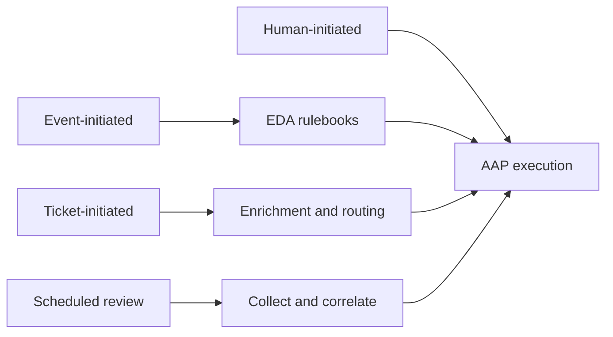

  

    <h1>Common AIOps Use Cases</h1>
    
Vendor-neutral adoption patterns for technical customer conversations after the initial AIOps pitch. AI identifies opportunities; automation delivers outcomes.

  

  

    <a href="https://github.com/ansible-tmm/solution-guides/edit/main/{{ page.path }}"
       target="_blank" class="edit-link">
      <i class="fas fa-pencil-alt" aria-hidden="true"></i>
      Edit on GitHub
    </a>
  

> **What these pages are for.**
>
> AIOps Use Cases explain **when** Event-Driven Ansible, AI enrichment, and Automation Orchestrator earn their place for a given operational pattern. They are **not** partner Solution Guides. Partner technologies may appear as examples; start with the [foundational AIOps Solution Guide](README-AIOps.md) for the full reference architecture, then open partner integrations from each use case's Related Solution Guides section.

## Crawl, Walk, Run

| Maturity | Focus | Use cases |
|----------|--------|-----------|
| **Crawl** | Build visibility and enrich insights | [Incident and Ticket Enrichment](README-AIOps-Use-Case-01-Incident-Ticket-Enrichment.md), [Cost and Resource Optimization](README-AIOps-Use-Case-02-Cost-Resource-Optimization.md) |
| **Walk** | Orchestrate and automate with intelligence | [Intelligent Capacity Orchestration](README-AIOps-Use-Case-03-Intelligent-Capacity-Orchestration.md), [Curated Automation Remediation](README-AIOps-Use-Case-04-Curated-Automation-Remediation.md) |
| **Run** | Autonomous operations and continuous enforcement | [System-Level Drift and Policy Enforcement](README-AIOps-Use-Case-05-System-Drift-Policy-Enforcement.md), [Self-healing infrastructure](README-AIOps-Use-Case-06-Self-Healing-Infrastructure.md) |

## How work starts

Workflows can begin from a human request, an observability event, an ITSM ticket, or a scheduled review. The use case describes the **pattern**; the entry point depends on the customer environment.

## All six use cases

<ol class="use-case-hub-list">
  <li class="use-case-hub-list__item">
    Crawl
    <strong><a href="{{ '/README-AIOps-Use-Case-01-Incident-Ticket-Enrichment' | relative_url }}">Incident and Ticket Enrichment</a></strong>
    Published
    
How do we stop wasting time just figuring out what happened?

  </li>
  <li class="use-case-hub-list__item">
    Crawl
    <strong><a href="{{ '/README-AIOps-Use-Case-02-Cost-Resource-Optimization' | relative_url }}">Cost and Resource Optimization</a></strong>
    Outline
    
How do we identify wasted capacity before it becomes an operational problem?

  </li>
  <li class="use-case-hub-list__item">
    Walk
    <strong><a href="{{ '/README-AIOps-Use-Case-03-Intelligent-Capacity-Orchestration' | relative_url }}">Intelligent Capacity Orchestration</a></strong>
    Outline
    
How do we anticipate capacity needs across hybrid environments?

  </li>
  <li class="use-case-hub-list__item">
    Walk
    <strong><a href="{{ '/README-AIOps-Use-Case-04-Curated-Automation-Remediation' | relative_url }}">Curated Automation Remediation</a></strong>
    Outline
    
How do we remediate faster using automation teams already trust?

  </li>
  <li class="use-case-hub-list__item">
    Run
    <strong><a href="{{ '/README-AIOps-Use-Case-05-System-Drift-Policy-Enforcement' | relative_url }}">System-Level Drift and Policy Enforcement</a></strong>
    Outline
    
How do we prevent slow failure and risk accumulation in the first place?

  </li>
  <li class="use-case-hub-list__item">
    Run
    <strong><a href="{{ '/README-AIOps-Use-Case-06-Self-Healing-Infrastructure' | relative_url }}">Self-healing infrastructure</a></strong>
    Outline
    
What do we do when something breaks, end to end?

  </li>
</ol>

## How this relates to Solution Guides

1. Read [AIOps automation with Ansible](README-AIOps.md) for the end-to-end reference architecture (EDA, inference, MCP, governed execution).
2. Pick the **use case** that matches the customer's operational question (table above).
3. Follow **Related Solution Guides** on that use case page for partner-specific depth (Splunk, ServiceNow, Azure, AWS, Instana, and others).

Solution Guides answer "how does AAP plus a partner solve X?" Use cases answer "which pattern are we selling, and when does each platform layer matter?"

## Browse the catalog

Return to the [Solution Guides catalog]({{ '/' | relative_url }}#aiops-use-cases) for partner integrations, or filter by partner on the homepage.
